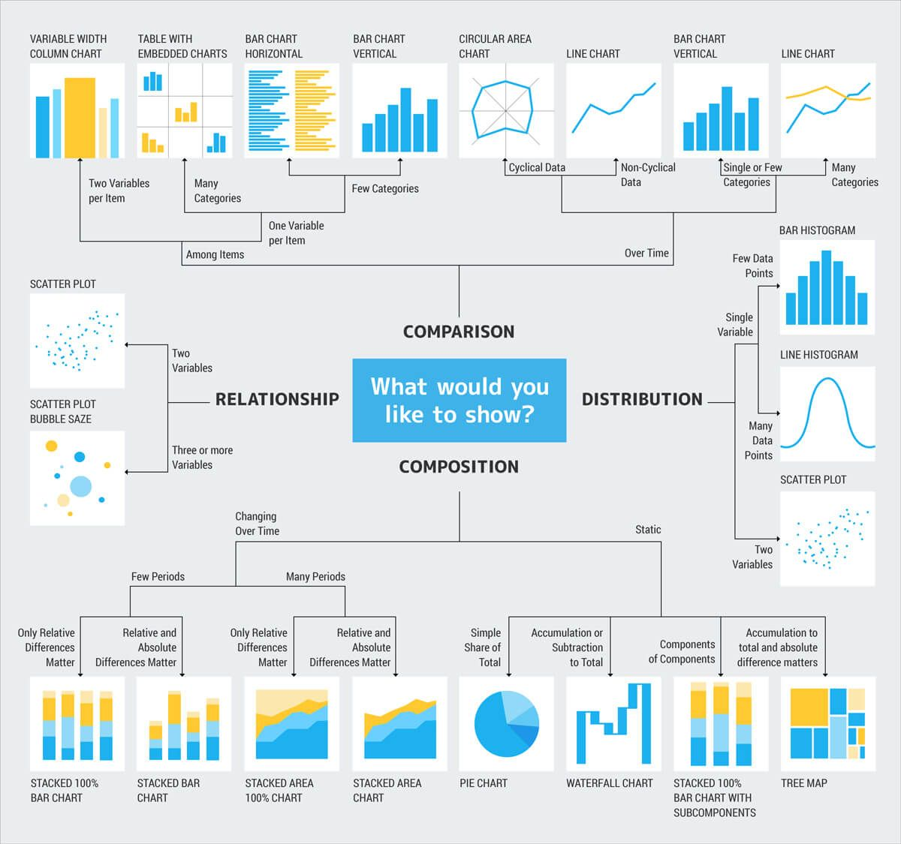
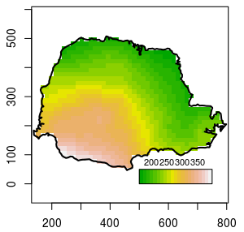
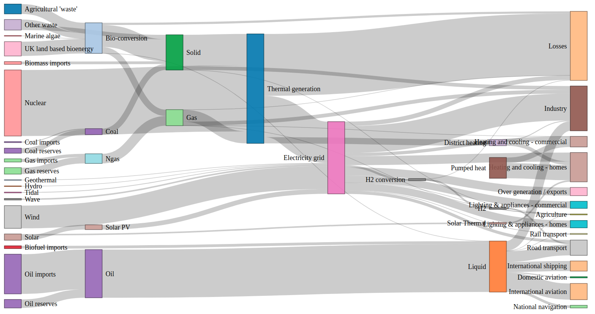

```{r, write_author_css, include = FALSE}
source("config-xaringan/custom_css.R")
```

```{r include = FALSE}
source("config/setup.R")
knitr::opts_chunk$set(out.width = "70%",
                      dev = "svg",
                      dev.args = list(family = "Roboto Condensed",
                                      bg = NA))
```

```{r include = FALSE}
read_chunk("00-graphics-gallery.R")
```

---
class: middle
# Por que conhecer os tipos de gráficos?

- Conhecer os tipos de gráficos mais usados.
- Compreender os aspectos físicos, funcionais e de forma dos gráficos.
- Desenvolver senso crítico para escolha de representações.
- Nutrir a criatividade para desenvolver novas visualizações.

---
# A escolha do gráfico

A escolha de um gráfico depende de uma série de elementos. Os principais
são:

- Escala das variáveis.
- Propósito da visualização $\rightarrow$ função do gráfico.
- Questões visuais/estéticas $\rightarrow$ forma do gráfico.

---
# Os 4 tipos de escala

```{r, echo = FALSE, fig.cap = cap}
cap <- NULL
knitr::include_graphics("img/tipos-variaveis.png")
```

---
# Taxonomia

```{r, echo = FALSE, fig.cap = cap, out.width = "55%"}
cap <- "Taxonomia de gráficos baseada na função por Andrew Abela. Visite: https://extremepresentation.com/."

```

---
# Taxonomia

- Agrupamento dos gráficos baseado nas características comuns.
- Função
  - Classificação principal: função do gráfico.
  - Relacionado às quantidades a serem representadas.
  - Quais quantidades/propriedades serão exibidas $\rightarrow$ o que?
- Forma
  - Classificação secundária: forma do gráfico.
  - Relacionado às decisões estéticas e de mídia.
  - Como as quantidades/propriedades serão exibidas $\rightarrow$ como?


---
# Função de um gráfico

```{r, echo = FALSE, fig.cap = cap}
cap <- NULL
knitr::include_graphics("img/funcao-grafico.png")
```

---
# Função de um gráfico

- Distribuição: Caracterizam a *distribuição* de variáveis qualitativas ou
  quantitativas.
- Relação: Exibem a forma da *relação* entre variáveis ou *contraste* entre categorias.
- Ordenação: Priorizam exibir a *classificação* de
  categorias/elementos baseada nas variáveis.
- Evolução: Exploram o comportamento de dados *cronológicos*.
- Mapa: Representam dados com propriedades *geográficas*.
- Organização: Retratam a *estrutura* de organização de coleções de
  categorias/elementos.
- Fluxo: Descrevem o *movimento ou conexão* entre
  categorias/elementos.

---
class: middle, title-slide, section
# Gráficos para a distribuição

Caracterizam a *distribuição* de variáveis qualitativas ou quantitativas

```{r read_futbol, include = FALSE}
```

---
# Diagrama de pontos

```{r height_stem, include = FALSE}
```
```{r height_dotplot, results = "hide", echo = FALSE, fig.cap = cap}
```

---
# Histograma

```{r height_histogram, results = "hide", echo = FALSE, fig.cap = cap}
```

---
# Densidade

```{r height_density, results = "hide", echo = FALSE, fig.cap = cap}
```

---
# Distribuição acumulada

```{r height_ecdf, results = "hide", echo = FALSE, fig.cap = cap}
```

---
# Diagrama de caixas e bigodes (boxplot)

```{r height_boxplot, results = "hide", echo = FALSE, fig.cap = cap}
```

---
# Diagrama de violinos (violin plot)

```{r height_violin, fig.dim = c(3, 3.5), out.width = "35%", results = "hide", echo = FALSE, fig.cap = cap}
```

---
# Joy plot

```{r height_joy, fig.dim = c(7, 3), out.width = "90%", results = "hide", echo = FALSE, fig.cap = cap}
```

---
# Gráficos de barras

```{r position_bar, results = "hide", echo = FALSE, fig.cap = cap}
```

---
# Gráfico de setores

```{r position_pie, results = "hide", echo = FALSE, fig.cap = cap}
```

---
# Gráfico de rosca

```{r position_donut, results = "hide", echo = FALSE, fig.cap = cap}
```

---
# Gráfico de waffle

```{r redcard_waffle, results = "hide", echo = FALSE, fig.cap = cap}
```

---
# Gráfico quantil-quantil

```{r bmi_qq, results = "hide", echo = FALSE, fig.cap = cap}
```

---
class: middle, title-slide, section
# Gráficos para a relação entre variáveis

Exibem a forma da *relação* entre variáveis ou *contraste* entre categorias

---
# Barras empilhadas e barras lado a lado

.pull-left[
```{r yel_stacked_bar, fig.dim = 0.75 * c(5, 4), out.width = "95%", results = "hide", echo = FALSE, fig.cap = cap}
```
]

.pull-right[
```{r yel_grouped_bar, fig.dim = 0.75 * c(5, 4), out.width = "95%", results = "hide", echo = FALSE, fig.cap = cap}
```
]

---
# Barras preenchidas

```{r yel_filled_bar, results = "hide", echo = FALSE, fig.cap = cap}
```

---
# Gráfico de mosaico

```{r yel_mosaic, results = "hide", echo = FALSE, fig.cap = cap}
```

---
# Diagrama de dispersão

```{r cm_x_kg, results = "hide", echo = FALSE, fig.cap = cap}
```

---
# Diagrama de dispersão tamanhos e cores

```{r cm_x_kg_x_age, results = "hide", echo = FALSE, fig.cap = cap}
```

---
# Matriz de diagramas de dispersão

```{r ggpairs, results = "hide", out.width = "40%", fig.dim = c(5, 5), echo = FALSE, fig.cap = cap}
```

---
# Correlograma

```{r correlogram, results = "hide", echo = FALSE, fig.cap = cap}
```

---
# Mapa de calor (heatmap)

```{r heatmap, results = "hide", echo = FALSE, fig.cap = cap}
```

---
# Gráfico de eixos paralelos

```{r parallel, results = "hide", echo = FALSE, fig.cap = cap}
```

---
# Gráfico de radar ou teia

```{r spider, results = "hide", out.width = "40%cm", fig.dim = c(5, 5), echo = FALSE, fig.cap = cap}
```

---
# Diagrama de Cleveland (Cleveland dot plot)

```{r cleveland, results = "hide", echo = FALSE, fig.cap = cap}
```

---
# Boxplots (o retorno)

```{r boxplots, results = "hide", echo = FALSE, fig.cap = cap}
```

---
# Diagrama de dispersão com dados agrupados

```{r hexbin, results = "hide", echo = FALSE, fig.cap = cap}
```


---
# Faces de Chernoff

```{r, echo = FALSE, fig.cap = cap}
cap <- "Faces de Chernoff para medidas descritivas dos jogadores conforme função em campo."
knitr::include_graphics("img/football_chernoff.png")
```

---
class: middle, title-slide, section
# Ordenação

Exibem a *classificação* de categorias/elementos baseada nas variáveis

---
# Barras ordenadas (Pareto)

.pull-left[
```{r ordered_bar, fig.dim = 0.75 * c(5, 4), out.width = "95%", results = "hide", echo = FALSE, fig.cap = cap}
```
]

.pull-right[
```{r lillipop, fig.dim = 0.75 * c(5, 4), out.width = "95%", results = "hide", echo = FALSE, fig.cap = cap}
```
]

---
# Núvem de palavras

```{r wordcloud, results = "hide", echo = FALSE, fig.cap = cap}
```

---
class: middle, title-slide, section
# Gráficos para a evolução

Exploram o comportamento de dados *cronológicos*

---
# Gráfico de série (pontos conectados)

```{r, echo = FALSE, fig.cap = cap}
cap <- "Gráfico de uma série temporal. Fonte: http://r-statistics.co/Top50-Ggplot2-Visualizations-MasterList-R-Code.html."

```

---
# Gráfico de série com dois eixos

```{r, echo = FALSE, fig.cap = cap}
cap <- "Séries com dois eixos. Fonte: http://freerangestats.info/blog/2016/08/18/dualaxes."
knitr::include_graphics("img/0051-dualgood.png")
```

---
# Gráfico de áreas

```{r, echo = FALSE, fig.cap = cap}
cap <- "Gráfico de áreas empilhadas. Fonte:
https://stackoverflow.com/questions/35587571/make-a-stacked-area-graph-in-ggplot2."
knitr::include_graphics("img/cZ1Dw.png")
```

---
# Gráficos de inclinação (slope graph)

.pull-left[
```{r, echo = FALSE, fig.cap = cap}
cap <- "Um exemplo de slopegraph. Fonte:
http://www.storytellingwithdata.com/blog/2018/6/1/swdchallenge-slopegraph."
knitr::include_graphics("img/SlopegraphProgression_7A.png")
```
]

.pull-right[
```{r, echo = FALSE, fig.cap = cap}
cap <- "Slopegraph com mais condições. Fonte:
https://shivathudi.com/2017/04/19/data-visualization-in-r-using-ggplot-and-shiny/."

```
]


---
# Diagrama de calendário

```{r, echo = FALSE, fig.cap = cap}
cap <- "Exemplo de gráfico de calendário. Fonte:
https://d2mvzyuse3lwjc.cloudfront.net/www/resources/graph_gallery/images_galleries_new/Calendar_Chart.png."
knitr::include_graphics("img/Calendar_Chart.png")
```

---
# Gráfico de cascata (waterfall)

```{r, echo = FALSE, fig.cap = cap}
cap <- "Exemplo de um gráfico de barras em cascata. Fonte:
https://www.ablebits.com/office-addins-blog/2014/07/25/waterfall-chart-in-excel/."
knitr::include_graphics("img/waterfall-chart.png")
```

---
# Diagrama de Gantt

```{r, echo = FALSE, fig.cap = cap}
cap <- "Exemplo de diagrama de Gantt. Fonte:
http://curiousgnu1.rssing.com/chan-66482562/all_p1.html."

```

---
# Gráfico de candelabro

```{r, echo = FALSE, fig.cap = cap, out.width = "50%"}
cap <- "Exemplo de gráfico de candelabro. Fonte:
https://stackoverflow.com/questions/28201587/ggplot-for-ohlc-chart-using-bars-not-candles."

```

---
class: middle, title-slide, section
# Mapas

---
# Mapa temático (colorpleth map)

```{r, echo = FALSE, fig.cap = cap, out.width = "50%"}
cap <- "Mapa de densidade populacional por Estado. Fonte:
https://gl.maps-brazil.com/brasil-densidade-de-poboación-mapa."

```

---
# Mapa de bolhas (bubble map)

```{r, echo = FALSE, fig.cap = cap, out.width = "50%"}
cap <- "Tradição indígenas no Brasil. Fonte:
[[https://journals.openedition.org/confins/7785]]."

```

---
# Mapa de elevação ou contornos de nível

.pull-left[
```{r, echo = FALSE, fig.cap = cap}
cap <- "Mapa do Paraná. Fonte:
http://www.leg.ufpr.br/geoR/PASI/."

```
]

.pull-right[
```{r, echo = FALSE, fig.cap = cap}
cap <- "Anomalias de temperaturas médias no Brasil para Abril de
2016. Fonte: https://www.bbc.com/portuguese/internacional/2016/05/160516_nasa_aquecimento_np."

```
]

---
# Mapa de densidade

```{r, echo = FALSE, fig.cap = cap, out.width = "60%"}
cap <- "Mapa de densidade de ocorrência. Fonte:
https://cran.r-project.org/package=HistData."
knitr::include_graphics("img/snow-map.png")
```

---
# Mapa de conexões

```{r, echo = FALSE, fig.cap = cap, out.width = "60%"}
cap <- "Mapa de conexões entre empresas e prefeituras no Paraná.
Fonte: Trabalho de Conclusão de Curso de Especialização em Data Science
& Big Data, Paulo Jhonny Scheleder da Costa Rosa."

```

---
# Cartograma

```{r, echo = FALSE, fig.cap = cap, out.width = "85%"}
cap <- "Cartograma da população mundial em 2020. Fonte:
https://giphy.com/gifs/geography-jpJ6VkD9k17cA."

```

---
class: middle, title-slide, section
# Organização

Retratam a *estrutura* de organização de coleções de categorias/elementos.

---
# Dendograma

.pull-left-30[
```{r, echo = FALSE, fig.cap = cap, out.width = "90%"}
cap <- "Exemplo de dendrograma. Fonte:
https://www.datanovia.com/en/courses/hierarchical-clustering-in-r-the-essentials/."

```
]

.pull-right-60[
```{r, echo = FALSE, fig.cap = cap, out.width = "90%"}
cap <- "Ideia para a construção do dendrograma. Fonte:
https://www.statisticshowto.datasciencecentral.com/hierarchical-clustering/."
knitr::include_graphics("img/clustergram.png")
```
]

---
# Mapa de árvore e empacotamento circular

.pull-left-60[
```{r, echo = FALSE, fig.cap = cap, out.width = "90%"}
cap <- "Exemplo de treemap. Fonte:
https://github.com/mtennekes/treemap."
knitr::include_graphics("img/treemap-population.png")
```
]

.pull-right-30[
```{r, echo = FALSE, fig.cap = cap, out.width = "90%"}
cap <- "Exemplo de circular packing. Fonte: https://d3indepth.com/layouts/."
knitr::include_graphics("img/circular-pack.png")
```
]

---
# Sunburst

```{r, echo = FALSE, fig.cap = cap}
cap <- "Exemplo de diagrama sunburst. Fonte:
https://www.debugpoint.com/2018/07/apps-visual-disk-usage-linux-ubuntu-mint/."
knitr::include_graphics("img/sunburst.png")
```

---
class: middle, title-slide, section
# Gráficos de relacionamento e fluxo

---
# Rede de relacionamento

.pull-left-60[
```{r, echo = FALSE, fig.cap = cap, out.width = "90%"}
cap <- "Exemplos de redes. Fonte:
https://kateto.net/network-visualization."

```
]

.pull-right-30[
```{r, echo = FALSE, fig.cap = cap, out.width = "70%"}
cap <- "Relação entre livros sobre visualização de dados comprados na
Amazon. Fonte: http://yasiv.com/#/Search?q=Data%20visualization."

```
]

---
# Variações de apresentação da rede

.pull-left-30[
```{r, echo = FALSE, fig.cap = cap, out.width = "90%"}
cap <- "Exemplo de rede radial. Fonte: https://truth-and-beauty.net/projects/muesli-ingredient-network."
knitr::include_graphics("img/radial-network-1.jpg")
```
]

.pull-right-60[
```{r, echo = FALSE, fig.cap = cap, out.width = "90%"}
cap <- "Exemplo de rede na forma de arco. Fonte:
https://plot.ly/~empet/13574/arc-diagram-of-star-wars-characters-that-interacted-in-the-force-awakens."

```
]

---
# Sankey diagram ou alluvial chart

.pull-left-50[
```{r, echo = FALSE, fig.cap = cap, out.width = "90%"}
cap <- "Exemplo de /Sankey diagram/. Fonte:
https://www.theinformationlab.co.uk/2018/03/09/build-sankey-diagram-tableau-without-data-prep-beforehand/.
[[file:]]"

```
]

.pull-right-50[
```{r, echo = FALSE, fig.cap = cap, out.width = "90%"}
cap <- "Exemplo de Sankey diagram com arcos. Fonte:
https://plotdb.com/chart/1039."
knitr::include_graphics("img/Sankey-Chord.png")
```
]

---
# Diagrama aluvial para processos

```{r, echo = FALSE, fig.cap = cap}
cap <- "Exemplo de Sankey diagram. Fonte:
https://www.r-graph-gallery.com/sankey-diagram/."

```

---
# Diagrama de cordas

```{r, echo = FALSE, fig.cap = cap}
cap <- "Exemplos de diagramas de corda. Fonte:
https://learningtableaublog.wordpress.com/2016/08/04/chord-diagrams/."
knitr::include_graphics("img/chord-diagram-1.png")
```

---
class: middle, title-slide, section
# Gráficos de resultados ou etapas de análise

---
# Gráficos de resultados ou etapas de análise

  * Gráficos para análise de diagnóstico em modelos de regressão.
  * Gráficos com intervalos de confiança ou bandas de confiança.
  * Gráficos de Kaplan-Meyer.
  * Gráficos de biplot para análise de componentes principais.
  * Gráficos HE-plot de análise multivariada.
  * Gráfico de Shewart para monitoramento de processos.
  * Gráfico de autocorrelação serial.
  * Gráfico de semivariograma.
  * Árvore de regressão/classificação.
  * etc.

<!-- .. -->
<!-- <script src="./config-xaringan/author-footnote.js"></script> -->
