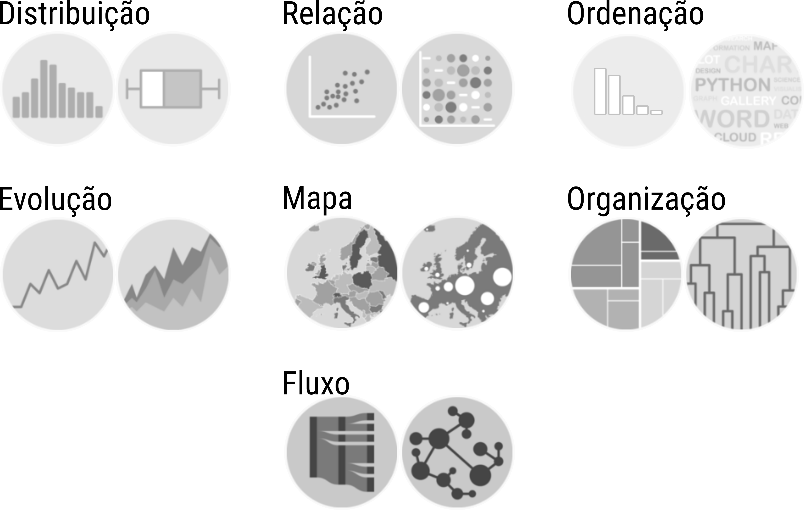

<!-- --- -->
<!-- class: middle -->
# Por que conhecer os tipos de gráficos?

- .orange[Nunca antes a **visualização de dados** esteve em tanta evidência].
- Conhecer os tipos de gráficos mais usados.
- Compreender os aspectos físicos, funcionais e de forma dos gráficos.
- Desenvolver senso crítico para escolha de representações.
- Nutrir a criatividade para desenvolver novas visualizações.

```{r, write_author_css, include = FALSE}
source("config-xaringan/custom_css.R")
```

```{r include = FALSE}
source("config/setup.R")
knitr::opts_chunk$set(out.width = "70%",
                      dev = "svg",
                      # cache = TRUE,
                      dev.args = list(family = "Roboto Condensed",
                                      bg = NA))
```

```{r include = FALSE}
read_chunk("00-graphics-gallery.R")
```

---
# A escolha do gráfico

A escolha de um gráfico depende de uma série de elementos. Os principais
são:

- Escala das variáveis.
- Propósito da visualização $\rightarrow$ função do gráfico.
- Questões visuais/estéticas $\rightarrow$ forma do gráfico.

---
# Os 4 tipos de escala

```{r, echo = FALSE, fig.cap = cap}
cap <- NULL
knitr::include_graphics("img/tipos-variaveis.png")
```

---

```{r, echo = FALSE, fig.cap = cap, out.width = "55%"}
cap <- "Taxonomia de gráficos baseada na função por Andrew Abela. Visite: https://extremepresentation.com/."
knitr::include_graphics("img/abela-chart-type.jpg")
```

---
# Taxonomia

- Agrupamento dos gráficos baseado nas características comuns.
- Função
  - Classificação principal: **função** do gráfico.
  - Relacionado às **quantidades** a serem representadas.
  - Quais quantidades/propriedades serão exibidas $\rightarrow$ **o que**?
- Forma
  - Classificação secundária: **forma** do gráfico.
  - Relacionado às decisões **estéticas** e de mídia.
  - Como as quantidades/propriedades serão exibidas $\rightarrow$ **como**?


---
# Função de um gráfico

```{r, echo = FALSE, fig.cap = cap}
cap <- NULL

```

---
# Função de um gráfico

.pull-left[

**Distribuição**</br>
Caracterizam a *distribuição* de variáveis qualitativas ou quantitativas.

**Relação**<br>
Exibem a forma da *relação* entre variáveis ou *contraste* entre categorias.

**Ordenação**<br>
Priorizam exibir a *classificação* de categorias/elementos baseada nas variáveis.

**Evolução**<br>
Exploram o comportamento de dados *cronológicos*.

]

.pull-right[

**Mapa**<br>
Representam dados com propriedades *geográficas*.

**Organização**<br>
Retratam a *estrutura* de organização de coleções de categorias/elementos.

**Fluxo**<br>
Descrevem o *movimento ou conexão* entre categorias/elementos.

]

---
class: middle, title-slide, section
# Gráficos para a distribuição
## Caracterizam a **distribuição** de variáveis qualitativas ou quantitativas

```{r read_futbol, include = FALSE}
```

---
# Diagrama de pontos

```{r height_stem, include = FALSE}
```
```{r height_dotplot, results = "hide", echo = FALSE, fig.cap = cap}
```

---
# Histograma

```{r height_histogram, results = "hide", echo = FALSE, fig.cap = cap}
```

---
# Densidade

```{r height_density, results = "hide", echo = FALSE, fig.cap = cap}
```

---
# Distribuição acumulada

```{r height_ecdf, results = "hide", echo = FALSE, fig.cap = cap}
```

---
# Diagrama de caixas e bigodes (boxplot)

```{r height_boxplot, results = "hide", echo = FALSE, fig.cap = cap}
```

---
# Diagrama de violinos (violin plot)

.pull-left-60[
```{r height_boxplot, out.width = "100%", results = "hide", echo = FALSE, fig.cap = cap}
```
]

.pull-right-30[
```{r height_violin, fig.dim = c(3, 3.5), out.width = "100%", results = "hide", echo = FALSE, fig.cap = cap}
```
]


---
# Joy plot

```{r height_joy, fig.dim = c(7, 3), out.width = "90%", results = "hide", echo = FALSE, fig.cap = cap}
```

---
# Gráficos de barras

```{r position_bar, results = "hide", echo = FALSE, fig.cap = cap}
```

---
# Gráfico de setores

```{r position_pie, results = "hide", echo = FALSE, fig.cap = cap}
```

---
# Gráfico de rosca

```{r position_donut, results = "hide", echo = FALSE, fig.cap = cap}
```

---
# Gráfico de waffle

```{r redcard_waffle, results = "hide", echo = FALSE, fig.cap = cap}
```

---
# Gráfico quantil-quantil

```{r bmi_qq, results = "hide", echo = FALSE, fig.cap = cap}
```

---
class: middle, title-slide, section
# Gráficos para a relação entre variáveis
## Exibem a forma da **relação** entre variáveis ou **contraste** entre categorias

---
# Barras empilhadas e barras lado a lado

.pull-left[
```{r yel_stacked_bar, fig.dim = 0.75 * c(5, 4), out.width = "95%", results = "hide", echo = FALSE, fig.cap = cap}
```
]

.pull-right[
```{r yel_grouped_bar, fig.dim = 0.75 * c(5, 4), out.width = "95%", results = "hide", echo = FALSE, fig.cap = cap}
```
]

---
# Barras preenchidas e mosaico

.pull-left[
```{r yel_filled_bar, out.width = "100%", fig.dim = 0.75 * c(5, 4), results = "hide", echo = FALSE, fig.cap = cap}
```
]

.pull-right[
```{r yel_mosaic, out.width = "100%", fig.dim = 0.75 * c(5, 4), results = "hide", echo = FALSE, fig.cap = cap}
```
]

---
# Diagrama de dispersão

```{r cm_x_kg, results = "hide", echo = FALSE, fig.cap = cap}
```

---
# Diagrama de dispersão tamanhos e cores

```{r cm_x_kg_x_age, out.width = "95%", fig.dim = c(9, 4), results = "hide", echo = FALSE, fig.cap = cap}
```

---
# Matriz de diagramas de dispersão

```{r ggpairs, results = "hide", out.width = "45%", fig.dim = c(5, 5), echo = FALSE, fig.cap = cap}
```

---
# Variações de diagramas de dispersão

.pull-left[
```{r, echo = FALSE, fig.cap = cap, out.width = "90%"}
cap <- "Exemplo de diagrama de dispersão tridimensional. Fonte: https://stackoverflow.com/questions/30904198/how-to-export-an-interactive-rgl-3d-plot-to-share-or-publish."

```
]

.pull-right[
```{r, echo = FALSE, fig.cap = cap, out.width = "90%"}
cap <- "Exemplo de diagrama ternário. Fonte: http://www.ggtern.com/2013/12/16/pps-3-state-model/."

```
]

---
# Correlograma

```{r correlogram, out.width = "100%", fig.dim = c(9, 4), results = "hide", echo = FALSE, fig.cap = cap}
```

---
# Mapa de calor (heatmap)

```{r heatmap, results = "hide", echo = FALSE, fig.cap = cap}
```

---
# Gráfico de eixos paralelos

```{r parallel, results = "hide", echo = FALSE, fig.cap = cap}
```

---
# Gráfico de radar ou teia

.pull-left[
```{r spider, results = "hide", out.width = "90%", fig.dim = c(5, 5), echo = FALSE, fig.cap = cap}
```
]

.pull-right[
```{r, eval = FALSE, echo = FALSE, fig.cap = cap, out.width = "90%"}
cap <- "Exemplo de gráfico radial mostrando o contraste entre cluster. Fonte: https://www.nature.com/articles/s41599-020-00590-z"
knitr::include_graphics("img/41599_2020_590_Fig1_HTML.png")
```
]

---
# Diagrama de Cleveland (Cleveland dot plot)

```{r cleveland, results = "hide", echo = FALSE, fig.cap = cap}
```

---
# Boxplots (o retorno)

```{r boxplots, results = "hide", echo = FALSE, fig.cap = cap}
```

---
# Diagrama de dispersão com dados agrupados

```{r hexbin, results = "hide", echo = FALSE, fig.cap = cap}
```


---
# Faces de Chernoff

```{r, echo = FALSE, fig.cap = cap, out.width = "50%"}
cap <- "Faces de Chernoff para medidas descritivas dos jogadores conforme função em campo."

```

---
class: middle, title-slide, section
# Ordenação
## Exibem a **classificação** de categorias/elementos baseada nas variáveis

---
# Barras ordenadas (Pareto)

.pull-left[
```{r ordered_bar, fig.dim = 0.75 * c(5, 4), out.width = "95%", results = "hide", echo = FALSE, fig.cap = cap}
```
]

.pull-right[
```{r lillipop, fig.dim = 0.75 * c(5, 4), out.width = "95%", results = "hide", echo = FALSE, fig.cap = cap}
```
]

---
# Núvem de palavras

```{r wordcloud, results = "hide", echo = FALSE, fig.cap = cap}
```

---
class: middle, title-slide, section
# Gráficos para a evolução
## Exploram o comportamento de dados **cronológicos**

---
# Gráfico de série (pontos conectados)

```{r, echo = FALSE, fig.cap = cap}
cap <- "Gráfico de uma série temporal. Fonte: http://r-statistics.co/Top50-Ggplot2-Visualizations-MasterList-R-Code.html."
knitr::include_graphics("img/ggplot_masterlist_39.png")
```

---
# Gráfico de série com dois eixos

```{r, echo = FALSE, fig.cap = cap}
cap <- "Séries com dois eixos. Fonte: http://freerangestats.info/blog/2016/08/18/dualaxes."

```

---
# Gráfico de áreas

```{r, echo = FALSE, fig.cap = cap}
cap <- "Gráfico de áreas empilhadas. Fonte:
https://stackoverflow.com/questions/35587571/make-a-stacked-area-graph-in-ggplot2."

```

---
# Gráficos de inclinação (slope graph)

.pull-left[
```{r, echo = FALSE, fig.cap = cap, out.width = "90%"}
cap <- "Um exemplo de slopegraph. Fonte:
http://www.storytellingwithdata.com/blog/2018/6/1/swdchallenge-slopegraph."
knitr::include_graphics("img/SlopegraphProgression_7A.png")
```
]

.pull-right[
```{r, echo = FALSE, fig.cap = cap, out.width = "85%"}
cap <- "Slopegraph com mais condições. Fonte:
https://shivathudi.com/2017/04/19/data-visualization-in-r-using-ggplot-and-shiny/."
knitr::include_graphics("img/slope-survival.png")
```
]


---
# Diagrama de calendário

```{r, echo = FALSE, fig.cap = cap}
cap <- "Exemplo de gráfico de calendário. Fonte:
https://d2mvzyuse3lwjc.cloudfront.net/www/resources/graph_gallery/images_galleries_new/Calendar_Chart.png."

```

---
# Diagrama de Gantt

```{r, eval = FALSE, echo = FALSE, fig.cap = cap}
cap <- "Exemplo de diagrama de Gantt. Fonte:
http://curiousgnu1.rssing.com/chan-66482562/all_p1.html."
knitr::include_graphics("img/gantt.png")
```

```{r, eval = FALSE, echo = FALSE, fig.cap = cap}
cap <- "Exemplo de diagrama de Gantt. Fonte:
https://www.nytimes.com/interactive/2020/04/30/opinion/coronavirus-covid-vaccine.html."
knitr::include_graphics("img/coronavirus-covid-19-vaccine-timeline-promo-1588200256894-superJumbo-v7.png")
```

---
# Gráfico de cascata (waterfall)

```{r, echo = FALSE, fig.cap = cap}
cap <- "Exemplo de um gráfico de barras em cascata. Fonte:
https://www.ablebits.com/office-addins-blog/2014/07/25/waterfall-chart-in-excel/."

```

---
# Gráfico de candelabro

```{r, echo = FALSE, fig.cap = cap, out.width = "50%"}
cap <- "Exemplo de gráfico de candelabro. Fonte:
https://stackoverflow.com/questions/28201587/ggplot-for-ohlc-chart-using-bars-not-candles."
knitr::include_graphics("img/candle-stick-1.png")
```

---
class: middle, title-slide, section
# Mapas
## Representam dados com propriedades **geográficas**

---
# Mapa temático (colorpleth map)

.pull-left-60[
```{r, eval = FALSE, echo = FALSE, fig.cap = cap, out.width = "100%"}
cap <- "Mapa do covid por Estado. Fonte:
https://www.ufpb.br/legat/contents/mapas-coronavirus/30-09-brasil.png."
knitr::include_graphics("img/30-09-brasil.png")
```
]

.pull-right-40[
```{r, echo = FALSE, fig.cap = cap, out.width = "100%"}
cap <- "Taxa de ocupação dos leitos na pandemia. Fonte:
https://portal.fiocruz.br/sites/portal.fiocruz.br/files/imagensPortal/situacaodeleitos_uti_covid_interna.jpg."
knitr::include_graphics("img/situacaodeleitos_uti_covid_interna.jpg")
```
]

---
# Mapa de bolhas (bubble map)

.pull-left-60[
```{r, echo = FALSE, fig.cap = cap, out.width = "100%"}
cap <- "Mapa do covid no mundo. Fonte: http://www.mexicosocial.org/wp-content/uploads/2020/04/mapa-covid.png."
knitr::include_graphics("img/mapa-covid.png")
```
]

.pull-right-30[
```{r, echo = FALSE, fig.cap = cap, out.width = "100%"}
cap <- "Mapa do covid no Brasil. Fonte: https://noticias.uol.com.br/saude/ultimas-noticias/redacao/2020/04/16/coronavirus-avanca-para-o-interior-do-brasil-veja-evolucao-em-mapa.htm."
knitr::include_graphics("img/cidades-infectadas-com-coronavirus-no-brasil-no-dia-14-de-abril-1586990006722_v2_879x1052.jpg")
```
]

---
# Mapa de elevação ou contornos de nível

.pull-left-60[
```{r, echo = FALSE, fig.cap = cap, out.width = "100%"}
cap <- "Mapa sobre o covid conforme idade e sexo. Fonte:
https://www.unicamp.br/unicamp/sites/default/files/inline-images/ju-man_mortalidade-covid_20210212_1.jpg."
knitr::include_graphics("img/ju-man_mortalidade-covid_20210212_1.jpg")
```
]

.pull-right-40[
```{r, echo = FALSE, fig.cap = cap, out.width = "100%"}
cap <- "Densidade de casos confirmados de covid. Fonte: https://www1.udesc.br/agencia/arquivos/25420/images/mapa_4_densidade.jpg."
knitr::include_graphics("img/mapa_4_densidade.jpg")
```
]

---
# Mapa de densidade

.pull-left[
```{r, echo = FALSE, fig.cap = cap, out.width = "60%"}
cap <- "Mapa de densidade de casos de covid. Fonte:
https://www.nsctotal.com.br/noticias/coronavirus-como-a-pandemia-evoluiu-de-forma-distinta-entre-santa-catarina-e-rio-grande-do."
knitr::include_graphics("img/WhatsApp Image 2020-05-13 at 18.38.08.png")
```
]

.pull-right[
```{r, echo = FALSE, fig.cap = cap, out.width = "80%"}
cap <- "Mapa de densidade de ocorrência. Fonte:
https://cran.r-project.org/package=HistData."

```
]

---
# Mapa de conexões

```{r, echo = FALSE, fig.cap = cap, out.width = "80%"}
cap <- "Mapa de disseminação do covid.
Fonte: https://www.fredhutch.org/en/news/center-news/2020/03/tracking-covid-19-trevor-bedford.html."
knitr::include_graphics("img/social-transmission-map.jpg")
```

---
# Cartograma

```{r, echo = FALSE, fig.cap = cap, out.width = "60%"}
cap <- "Cartograma de casos de covid no Brasil. Fonte:
https://www.agb.org.br/covid19/2020/08/08/anamorfose-geografica-da-covid-19-no-brasil/."
knitr::include_graphics("img/Anamorfose-Casos-14-julho-scaled.jpeg")
```

---
class: middle, title-slide, section
# Organização
## Retratam a **estrutura** de organização de coleções de categorias/elementos

---
# Dendograma

.pull-left-40[
```{r, echo = FALSE, fig.cap = cap, out.width = "100%"}
cap <- "Exemplo de dendrograma. Fonte:
https://www.datanovia.com/en/courses/hierarchical-clustering-in-r-the-essentials/."
knitr::include_graphics("img/dendrogram.png")
```
]

.pull-right-60[
```{r, echo = FALSE, fig.cap = cap, out.width = "90%"}
cap <- "Ideia para a construção do dendrograma. Fonte:
https://www.statisticshowto.datasciencecentral.com/hierarchical-clustering/."
knitr::include_graphics("img/clustergram.png")
```
]

---
# Dendograma com mapa de calor

```{r, echo = FALSE, fig.cap = cap, out.width = "80%"}
cap <- "Exemplo de dendrograma com mapa de calor. Fonte:
https://www.researchgate.net/profile/Giovanni-Giuliano/publication/51761161."
knitr::include_graphics("img/Cluster-heat-map-of-gene-expression-data-The-hierarchical-clustering-was-generated-using.png")
```

---
# Mapa de árvore e empacotamento circular

.pull-left-60[
```{r, echo = FALSE, fig.cap = cap, out.width = "100%"}
cap <- "Exemplo de treemap. Fonte:
https://github.com/mtennekes/treemap."

```
]

.pull-right-40[
```{r, echo = FALSE, fig.cap = cap, out.width = "100%"}
cap <- "Exemplo de circular packing. Fonte: https://d3indepth.com/layouts/."
knitr::include_graphics("img/circular-pack.png")
```
]

---
# Sunburst

```{r, echo = FALSE, fig.cap = cap}
cap <- "Exemplo de diagrama sunburst. Fonte:
https://www.debugpoint.com/2018/07/apps-visual-disk-usage-linux-ubuntu-mint/."

```

---
class: middle, title-slide, section
# Gráficos de relacionamento e fluxo
## Descrevem o **movimento** ou **conexão** entre categorias/elementos

---
# Rede de relacionamento

.pull-left-60[
```{r, echo = FALSE, fig.cap = cap, out.width = "100%"}
cap <- "Exemplos de redes. Fonte:
https://kateto.net/network-visualization."
knitr::include_graphics("img/visNetwork-3.png")
```
]

.pull-right-40[
```{r, echo = FALSE, fig.cap = cap, out.width = "100%"}
cap <- "Relação entre livros sobre visualização de dados comprados na
Amazon. Fonte: http://yasiv.com/#/Search?q=Data%20visualization."
knitr::include_graphics("img/yasiv.png")
```
]

---
# Variações de apresentação da rede

.pull-left-40[
```{r, echo = FALSE, fig.cap = cap, out.width = "100%"}
cap <- "Exemplo de rede radial. Fonte: https://truth-and-beauty.net/projects/muesli-ingredient-network."

```
]

.pull-right-60[
```{r, echo = FALSE, fig.cap = cap, out.width = "100%"}
cap <- "Exemplo de rede na forma de arco. Fonte:
https://plot.ly/~empet/13574/arc-diagram-of-star-wars-characters-that-interacted-in-the-force-awakens."
knitr::include_graphics("img/arc-diagram.png")
```
]

---
# Sankey diagram ou alluvial chart

.pull-left-50[
```{r, echo = FALSE, fig.cap = cap, out.width = "90%"}
cap <- "Exemplo de Sankey diagram. Fonte:
https://www.theinformationlab.co.uk/2018/03/09/build-sankey-diagram-tableau-without-data-prep-beforehand/.
[[file:]]"
knitr::include_graphics("img/sankey-1.png")
```
]

.pull-right-50[
```{r, echo = FALSE, fig.cap = cap, out.width = "90%"}
cap <- "Exemplo de Sankey diagram com arcos. Fonte:
https://plotdb.com/chart/1039."

```
]

---
# Diagrama aluvial para processos

```{r, echo = FALSE, fig.cap = cap}
cap <- "Exemplo de Sankey diagram aplicado ao covid. Fonte:
https://www.sciencedirect.com/science/article/pii/S1871402120302332?dgcid=rss_sd_all."
knitr::include_graphics("img/1-s2.0-S1871402120302332-gr14.jpg")
```

---
# Diagrama de cordas

```{r, echo = FALSE, fig.cap = cap}
cap <- "Exemplos de diagramas de corda. Fonte:
https://learningtableaublog.wordpress.com/2016/08/04/chord-diagrams/."

```

---
class: middle, title-slide, section
# .orange[Vários, vários, vários gráficos sobre o Covid-19]

.center[
<https://statsandr.com/blog/top-r-resources-on-covid-19-coronavirus/>
]

---
class: middle, title-slide, section
# Gráficos de resultados ou etapas de análise

---
# Gráficos de resultados ou etapas de análise

  * Gráficos para análise de diagnóstico em modelos de regressão.
  * Gráficos com intervalos de confiança ou bandas de confiança.
  * Gráficos de sobreviência de Kaplan-Meyer.
  * Gráficos de biplot para análise de componentes principais.
  * Gráficos HE-plot de análise multivariada.
  * Gráfico de Shewart para monitoramento de processos.
  * Gráfico de autocorrelação serial.
  * Gráfico de semivariograma e krigagem.
  * Gráficos de árvore de regressão/classificação.
  * etc.

---
# Considerações finais

.pull-left[
## Conclusões

  * Nunca antes visualização de dados esteve em tanta **evidência**.
  * Conhecer os tipos de gráficos, suas funções e formas, conduz a **escolhas mais apropriadas** para representação de dados e storytelling.
  * Uso combinado e integrado de gráficos são os painéis ou dashboards.
  * Ainda tem-se os gráficos interativos.

]

.pull-right[
## Alguns links

  * O que você deve evitar (a partir do slide 144):
    <http://leg.ufpr.br/~walmes/cursoR/data-vis/slides/00-graphics-gallery.pdf>.
  * A gramática dos gráficos (a partir do slide 17):
    <http://leg.ufpr.br/~walmes/cursoR/data-vis/slides/08-ggplot2.pdf>.
  * Recursos para a visualização de dados e a lógica do `ggplot2`:
    <https://www.youtube.com/embed/KvWCppWip7I>

]

```{r, include = FALSE, eval = FALSE}
if (require(xaringanBuilder)) {
  xaringanBuilder::build_pdf(input = "00-catalogo-de-graficos.html")
}
```


<!-- .. -->
<script src="./config-xaringan/author-footnote.js"></script>
