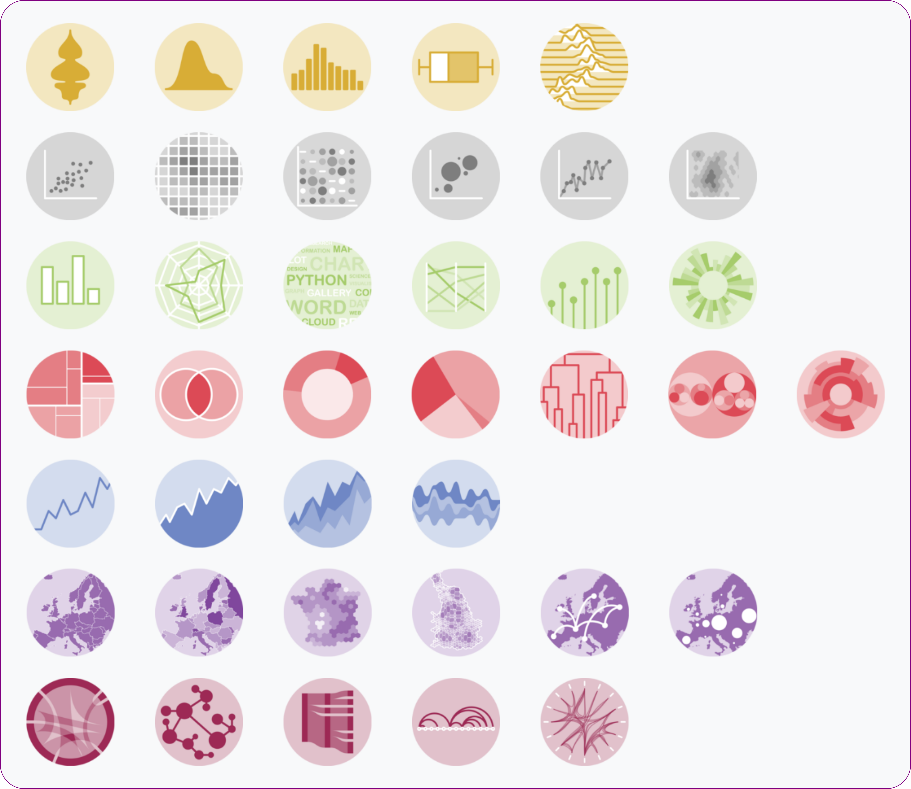
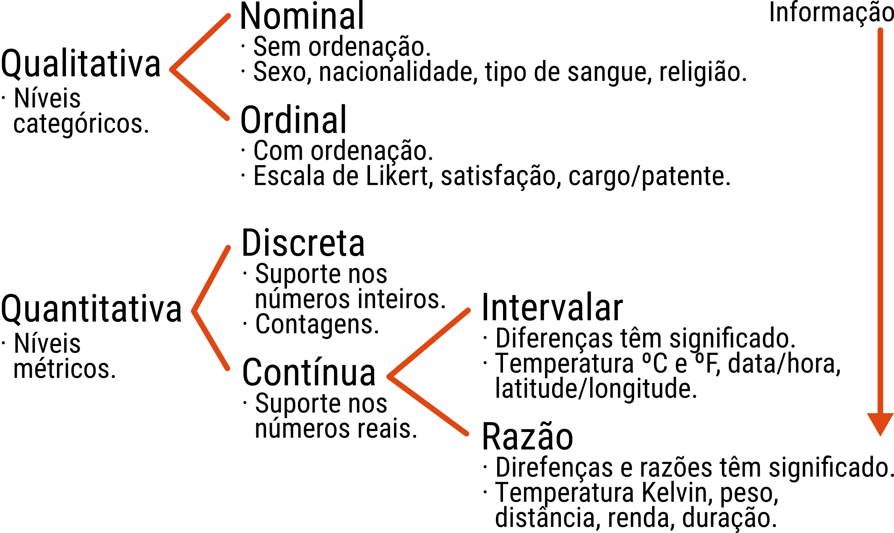

```{r, include = FALSE}
source("config/setup.R")
```

# Motivação

## Por que conhecer os tipos de gráficos?

  * Conhecer os tipos de representação.
  * Usar os gráficos mais apropriados.
  * Desenvolver senso crítico para escolha de represetações.
  * Nutrir a criatividade para desenvolver novas visualizações.
  * TODO TODO

## Galeria de gráficos

```{r, echo = FALSE, out.width = "7 cm", fig.cap = cap}
cap <- "Tipos de gráficos para visualização de dados"

```

## Galerias online

  1. <https://www.data-to-viz.com/>.
  2. R: <https://www.r-graph-gallery.com/>.
  3. Python Matplotlib: <https://matplotlib.org/gallery/index.html>.
  4. Tableau: <https://public.tableau.com/en-us/s/gallery>.
  5. D3: <https://github.com/d3/d3/wiki/Gallery>, <http://biovisualize.github.io/d3visualization/>.
  6. Highcharter: <http://jkunst.com/highcharter/>.
  7. Google charts: <https://developers.google.com/chart/interactive/docs/gallery>.
  8. Dash: <https://dash.plot.ly/gallery>.
  9. Zingchart: <https://www.zingchart.com/gallery/>.
  10. Original Lab: <https://www.originlab.com/www/products/graphgallery.aspx>.
  11. Fusion charts: <https://www.fusioncharts.com/charts?product=fusioncharts>.

## Os 4 tipos de escala

```{r, echo = FALSE, out.width = "11 cm"}
cap <- "Os 4 tipos de variáveis."

```

## Casos especiais

  * Dados cronológicos: datas, datas e tempo, duração,
    período. Problemas: Fusos horários, horário de verão, anos
    bissextos, etc.
  * Dados composicionais: a soma é fixa. Média de dados composicionais.
  * Dados circulares: dados cíclicos.
  * Dados geográficos: latitude e longitude.

## Função de um gráfico

Distribuição
: TODO

Relação
: TODO

Ordenação
: TODO

Evolução
: TODO

Mapa
: TODO

Organização
: TODO

Fluxo
: TODO

<!-- .
# Datasets
## Futebol
## População residente
## Imóveis
## Avaliação de veículos
## Traithlon
## Veículos a venda
-->

# Distribuição

## Diagrama de ramos e folhas

## Diagrama de pontos (stacked dot plot)

  * **Nome**: *stacked dot plot*.
  * **Função**: distribuição de valores.
  * **Tipo de escala**: quantitativa.
  * **Variáveis visuais**: posição $x$ e $y$.
  * **Geometria**: pontos empilhados.
  * **Requisitos definíveis**: intervalos de classe.
  * **Variáveis calculadas**: frequência absoluta.

## Histograma

  * **Nome**: histograma.
  * **Função**: distribuição de valores.
  * **Tipo de escala**: quantitativa.
  * **Variáveis visuais**: posição $x$ e $y$.
  * **Geometria**: barras.
  * **Requisitos definíveis**: intervalos de classe.
  * **Variáveis calculadas**: frequência absoluta, relativa ou
    densidade.

## Distribuição acumulada

  * **Nome**: *empirical cumulative distribution function* (ECDF).
  * **Função**: distribuição acumulada de valores.
  * **Tipo de escala**: quantitativa.
  * **Variáveis visuais**: posição $x$ e $y$.
  * **Geometria**: linhas.
  * **Variáveis calculadas**: frequência relativa acumulada.

## Densidade

  * **Nome**: distribuição empírica de densidade.
  * **Função**: distribuição de valores.
  * **Tipo de escala**: quantitativa.
  * **Variáveis visuais**: posição $x$ e $y$.
  * **Geometria**: linhas.
  * **Requisitos definíveis**: função kernel e largura de banda.
  * **Variáveis calculadas**: densidade empírica.

## Caixas e bigodes

  * **Nome**: diagrama de caixas (e bigodes) (box (and whiskers)).
  * **Função**: distribuição de valores pelas separatrizes.
  * **Tipo de escala**: quantitativa.
  * **Variáveis visuais**: posição $x$ e $y$.
  * **Geometria**: caixas, segmentos e pontos.
  * **Variáveis calculadas**: quartis, extremos, amplitude
    interquatílica e IC para mediana\*.

## Violino

  * **Nome**: *violin plot*.
  * **Inspiração**: densidade empírica.

## Joyplot

  * **Nome**: *Joyplot* ou *ridgeline plots*.
  * **Inspiração**: densidade empírica.

## Gráfico quantil-quantil

  * **Nome**: gráfico quantil-quantil.
  * **Função**: examinar a adequação de distribuição de probabilidades.
  * **Tipo de escala**: quantitativa.
  * **Variáveis visuais**: posição $x$ e $y$.
  * **Geometria**: pontos e linhas.
  * **Variáveis calculadas**: quantis teóricos da distribuição
    atribuída.

<!-- .
## Barras
## Stacked bar -> empilhadas, pirâmide etária
## Grouped bar -> lado a lado
## Barras de altura normalizada
## Mosaico
## ** Versão polar de todos acima, Setores, Doughnut
## unit chart, waffer chart
## Area size
## Word cloud
-->

# Relação

## Diagrama de dispersão

  * **Nome**: diagrama de dispersão (scatter plot).
  * **Função**: relação entre variáveis.
  * **Tipo de escala**: quantitativa $\times$ quantitativa.
  * **Variáveis visuais**: posição $x$ e $y$.
  * **Geometria**: pontos.
  * **Variações**: diagrama de dispersão 3D, diagrama ternário.

## Bubble chart

  * **Nome**: diagrama de dispersão (scatter plot).
  * **Função**: relação entre variáveis.
  * **Tipo de escala**: quantitativa $\times$ quantitativa $\times$ quantitativa.
  * **Variáveis visuais**: posição $x$ e $y$ e tamanho.
  * **Geometria**: pontos.

## Boxplot

  * **Nome**: diagrama de dispersão (scatter plot).
  * **Função**: relação entre variáveis.
  * **Tipo de escala**: quantitativa $\times$ qualitativa.
  * **Inspiração**: boxplot.
  * **Variação**: *minimal box plot*.

## Matriz de diagramas de dispersão

  * **Nome**: matriz de diagramas de dispersão (scatter plot matrix).
  * **Função**: relação entre variáveis e distribuição.
  * **Tipo de escala**: quantitativas $\times$ quantitativas.
  * **Variáveis visuais**: posição $x$ e $y$.
  * **Geometria**: pontos, linhas e/ou barras.
  * **Inspiração**: diagrama de dispersão e gráficos para distribuição.

## Cleveland dot plot

  * **Nome**: *Cleveland dot plot*.
  * **Função**: relação entre variável contínua e categóricas.
  * **Tipo de escala**: quantitativas $\times$ qualitativa $\times$ qualitativa.
  * **Variáveis visuais**: posição $x$ e $y$.
  * **Geometria**: pontos e segmentos.

## Slopegraph

  * **Nome**: *Slopegraph*.
  * **Função**: relação entre variáveis contínuas e uma categórica.
  * **Tipo de escala**: quantitativas $\times$ qualitativa.
  * **Variáveis visuais**: posição $x$ e $y$.
  * **Geometria**: pontos conectados.

## Parallel plot

  * **Nome**: *Slopegraph*.
  * **Função**: relação entre várias variáveis contínuas.
  * **Tipo de escala**: quantitativas $\times$ quantitativas.
  * **Variáveis visuais**: posição $x$ e $y$.
  * **Geometria**: linhas.
  * **Inspiração**: *slopegraph*.
  * **Variações**: radar/spider plot.

## Correlograma

  * **Nome**: Correlograma (*correlogram*).
  * **Função**: corelação entre várias variáveis contínuas.
  * **Tipo de escala**: quantitativas $\times$ quantitativas.
  * **Variáveis visuais**: área, inclinação ou outra retinal
    quantitativa.
  * **Geometria**: elipses, círculos ou retângulos.

## Mapa de calor

  * **Nome**: Mapa de calor (*heatmap*).
  * **Função**: relação entre várias variáveis contínuas.
  * **Tipo de escala**: quantitativas $\times$ quantitativas.
  * **Variáveis visuais**: posição $x$ e $y$, cor ou saturação.
  * **Geometria**: pixels coloridos.

## Densidade 2D

  * **Nome**: Densidade 2D.
  * **Função**: relação e distribuição de valores.
  * **Tipo de escala**: quantitativas $\times$ quantitativas.
  * **Variáveis visuais**: posição $x$ e $y$, cor ou saturação.
  * **Geometria**: pixels coloridos ou linhas de contorno.

## Faces de Chernoff

  * **Nome**: Faces de Chernoff (*Chernoff faces*).
  * **Função**: relação entre várias variáveis .
  * **Tipo de escala**: quantitativas $\times$ quantitativas.
  * **Variáveis visuais**: posição e comprimentos.
  * **Geometria**: elementos do rosto humano.

## Gráficos de barras

  Todos os tipos são úteis. A altura não é baseada em frequência mas
  depende de uma variável de escala razão.

<!-- .

ATTENTION: velocímetro: gauge.

# Ordenação
## Barras ordenadas pareto
## Lollipop ou Clevaland dot plot
## Também são classificados aqui

# Evolução
## Linhas conectadas
## Duas séries, dois eixos
## Slopegraph
## Sparklines
## Áreas empilhadas
## Calendar plot

# Mapa
## Mapas de fundo do google, geojson, shape
## Colorpleth, dados de área
## Bubble map, área ou ponto / shiny geor
## Cartograma
## Raster, levelplot, topological/ shiny geor
## Conexão
## Hexbin
## Contourplot

# Organização
## Dendrograma ou árvore
## Treemap: http://newsmap.jp/
## Sunburst
## Venn
## Circular packing, como treemap mas circular

# Fluxo
## Chord diagram, radial network
## Sankey, alluvial chart
## Diagrama de arco
## Network: http://yasiv.com/
## Floxograma
## Bubble hierarchy, dente de leão Rondon
ATTENTION: https://news-explorer.mybluemix.net/?query=data%20science&type=unconstrained

# Adornação

  * Linhas de tendência/separação.
  * Barras de erro.
  * Anotações.
  * Linhas de referência.
  * Destacamento.

# O que você deve evitar (BAD)

-->

## TODO

## Referências
