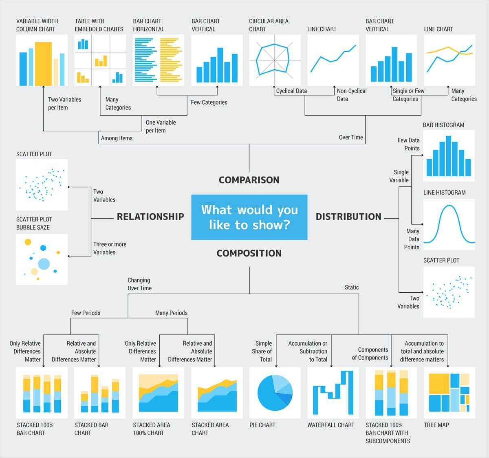
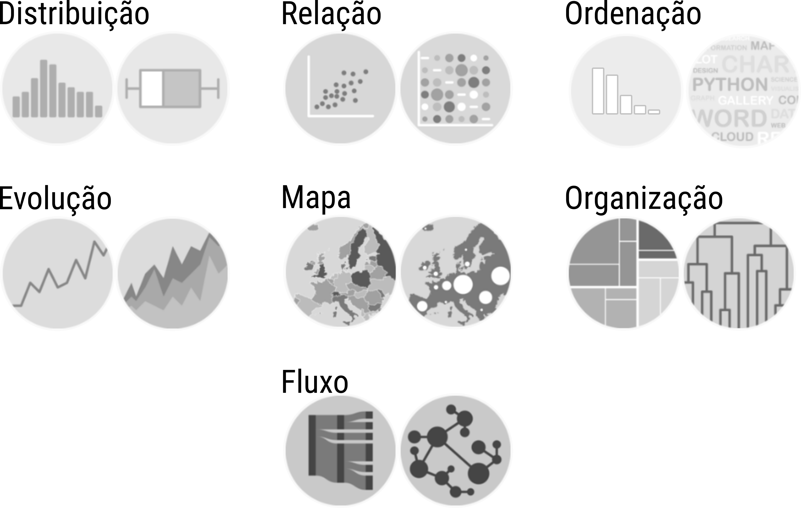

```{r, include = FALSE}
source("config/setup.R")

two_columns <- function(left = 0.3, right = 0.69) {
    doc <- knitr::opts_knit$get("rmarkdown.pandoc.to")
    if (isTRUE(doc == "beamer")) {
        u <- c(
            sprintf("\\begin{columns}[c]\n  \\begin{column}{%0.2f\\linewidth}\n", left),
            sprintf(" \\end{column}\n  \\begin{column}{%0.2f\\linewidth}\n", right),
            " \\end{column}\n\\end{columns}\n")
        return(u)
    } else {
        return(c("\n", "\n", "\n"))
    }
}
```
```{r, include = FALSE}
read_chunk("00-graphics-gallery.R")
```

# Motivação

## Por que conhecer os tipos de gráficos?

  * Conhecer os tipos de representação.
  * Usar os gráficos mais apropriados.
  * Desenvolver senso crítico para escolha de represetações.
  * Nutrir a criatividade para desenvolver novas visualizações.
  * TODO TODO
  * Melhor entendimento dos aspectos físicos, funcionais e de forma dos
    gráficos por meio dos quais melhor representar os dados.
  * Coleção dos gráficos mais usados hoje para exibição de dados.
  * Estar equipado para determinar o gráfico que é solução adequada e
    eficiente para problemas específicos.

## Os 4 tipos de escala

```{r, echo = FALSE, out.width = "11 cm"}
knitr::include_graphics("img/tipos-variaveis.png")
```

## Casos especiais

  * Dados cronológicos: datas, datas e tempo, duração,
    período. Problemas: Fusos horários, horário de verão, anos
    bissextos, etc.
  * Dados composicionais: a soma é fixa. Média de dados composicionais.
  * Dados circulares: dados cíclicos.
  * Dados geográficos: latitude e longitude.

## Taxonomia

```{r, echo = FALSE, out.width = "7 cm", fig.cap = cap}
cap <- "Tipos de gráficos organizados por função de Andrew Abela. Visite: \\url{https://extremepresentation.com/}."

```

## Taxonomia

  * Organização por agrupamento de membros que compartilham as mesmas
    características.
  * Função e forma de um gráfico.
  * Função: TODO envolve a representação dos dados?
  * Forma: TODO envolve a apresentação?

## Função de um gráfico

```{r, echo = FALSE, out.width = "10 cm"}

```

## Função de um gráfico

Distribuição
: Caracterizam a **distribuição ou divisão** de variáveis qualitativas
  ou quantitativas.

Relação
: Exibem a forma da **relação ou contraste** entre variáveis.

Ordenação
: Exibem os dados considerando a **classificação** baseada nas
  variáveis.

Evolução
: Exploram o curso de dados **cronológicos**.

Mapa
: Representam dados com propriedades **geoespaciais**.

Organização
: Retratam a **estrutura** hierárquica de coleções de elementos.

Fluxo
: Descrevem o **movimento ou conexão** entre elementos.


<!-- .
# Datasets
## Futebol
## População residente
## Imóveis
## Avaliação de veículos
## Traithlon
## Veículos a venda
-->

# Distribuição

## Conjunto de dados

```{r, read_futbol, echo = FALSE}
```

## Diagrama de ramos e folhas

```{r, height_stem, echo = FALSE}
```

## Diagrama de pontos (stacked dot plot)

  * **Nome**: *stacked dot plot*.
  * **Função**: distribuição de valores.
  * **Tipo de escala**: quantitativa.
  * **Variáveis visuais**: posição $x$ e $y$.
  * **Geometria**: pontos empilhados.
  * **Requisitos definíveis**: intervalos de classe.
  * **Variáveis calculadas**: frequência absoluta.

## Histograma

  * **Nome**: histograma.
  * **Função**: distribuição de valores.
  * **Tipo de escala**: quantitativa.
  * **Variáveis visuais**: posição $x$ e $y$.
  * **Geometria**: barras.
  * **Requisitos definíveis**: intervalos de classe.
  * **Variáveis calculadas**: frequência absoluta, relativa ou
    densidade.

## Densidade

  * **Nome**: distribuição empírica de densidade.
  * **Função**: distribuição de valores.
  * **Tipo de escala**: quantitativa.
  * **Variáveis visuais**: posição $x$ e $y$.
  * **Geometria**: linhas.
  * **Requisitos definíveis**: função kernel e largura de banda.
  * **Variáveis calculadas**: densidade empírica.
  * **Aplicação Shiny**: <http://shiny.leg.ufpr.br/walmes/density/>.

## Distribuição acumulada

  * **Nome**: *empirical cumulative distribution function* (ECDF).
  * **Função**: distribuição acumulada de valores.
  * **Tipo de escala**: quantitativa.
  * **Variáveis visuais**: posição $x$ e $y$.
  * **Geometria**: linhas.
  * **Variáveis calculadas**: frequência relativa acumulada.

## Caixas e bigodes

  * **Nome**: diagrama de caixas (e bigodes) (box (and whiskers)).
  * **Função**: distribuição de valores pelas separatrizes.
  * **Tipo de escala**: quantitativa.
  * **Variáveis visuais**: posição $x$ e $y$.
  * **Geometria**: caixas, segmentos e pontos.
  * **Variáveis calculadas**: quartis, extremos, amplitude
    interquatílica e IC para mediana\*.

## Violino

  * **Nome**: *violin plot*.
  * **Inspiração**: densidade empírica.

## Joyplot

  * **Nome**: *Joyplot* ou *ridgeline plots*.
  * **Inspiração**: densidade empírica.

## Recomendações

Qual usar para:

  1. Reconhecer forma da distribuição?
  2. Determinar medidas de locação e dispersão?
  3. Determinar proporções e separatrizes?

## Gráfico de barras

  * **Nome**: Gráfico de barras (*bar chart*).
  * **Função**: exibir a frequência de categorias.
  * **Tipo de escala**: qualitativa.
  * **Variáveis visuais**: posição $x$ e $y$.
  * **Geometria**: barras.
  * **Variáveis calculadas**: frequência absoluta ou relativa.
  * **Variações**:
    * Barras agrupadas (*grouped bar chart*).
    * Barras empilhadas (*stacked bar chart*).
    * Barras normalizadas (*normalized stacked bar chart*).

## Gráfico de setores

  * **Nome**: Gráfico de setores (*pie chart*).
  * **Função**: exibir a frequência relativa de categorias.
  * **Tipo de escala**: qualitativa.
  * **Variáveis visuais**: ângulo.
  * **Geometria**: setores circulares.
  * **Variáveis calculadas**: frequência relativa.
  * **Variações**: *donut chart* ou *doughnut chart*.

## Gráfico de rosca

  * **Nome**: Gráfico de rosca (*donut chart*).
  * **Inspiração**: gráfico de setores.
  * **Geometria**: arcos.

## Waffle chart

  * **Nome**: *Waffle chart*.
  * **Função**: exibir a frequência relativa de categorias.
  * **Tipo de escala**: qualitativa.
  * **Variáveis visuais**: área e cor.
  * **Geometria**: pixels.
  * **Variáveis calculadas**: frequência relativa.
  * **Variações**: *area size chart*.

## Recomendações

Qual usar para:

  1. Reconhecer a distribuição dos valores?
  2. Comparar as proporções?
  3. Enfatizar categorias de baixa frequência?

## Gráfico quantil-quantil

  * **Nome**: gráfico quantil-quantil.
  * **Função**: examinar a adequação de uma distribuição de
    probabilidades.
  * **Tipo de escala**: quantitativa.
  * **Variáveis visuais**: posição $x$ e $y$.
  * **Geometria**: pontos e linhas.
  * **Variáveis calculadas**: quantis teóricos da distribuição
    atribuída.

# Relação

## Gráficos de barras agrupadas e empilhadas

  * **Nome**: Gráfico de barras (*bar plot*).
  * **Função**: permitir a comparação de quantidades entre categorias.
  * **Tipo de escala**: qualitativa $\times$ qualitativas.
  * **Variáveis visuais**: posição $x$ e $y$.
  * **Geometria**: barras.

## Gráfico de mosaico

  * **Nome**: Gráfico de mosaico (*mosaic plot* ou *Marimekko chart*).
  * **Função**: exibir a frequência de combinações de categorias.
  * **Tipo de escala**: qualitativa.
  * **Variáveis visuais**: posição $x$ e $y$ e área.
  * **Geometria**: retângulos.
  * **Variáveis calculadas**: frequência relativa.

## Recomendações

Qual usar para:

  1. Comparar valores totais entre categorias?
  2. Comparar valores relativos entre categorias?
  3. Examinar a relação entre variáveis categóricas?

## Diagrama de dispersão

  * **Nome**: diagrama de dispersão (scatter plot).
  * **Função**: relação entre variáveis.
  * **Tipo de escala**: quantitativa $\times$ quantitativa.
  * **Variáveis visuais**: posição $x$ e $y$.
  * **Geometria**: pontos.
  * **Variações**: diagrama de dispersão 3D, diagrama ternário.

## Bubble chart

  * **Nome**: diagrama de dispersão (scatter plot).
  * **Função**: relação entre variáveis.
  * **Tipo de escala**: quantitativa $\times$ quantitativa $\times$ quantitativa.
  * **Variáveis visuais**: posição $x$ e $y$ e tamanho.
  * **Geometria**: pontos.

## Boxplot

  * **Nome**: diagrama de dispersão (scatter plot).
  * **Função**: relação entre variáveis.
  * **Tipo de escala**: quantitativa $\times$ qualitativa.
  * **Inspiração**: boxplot.
  * **Variação**: *minimal box plot*.

## Matriz de diagramas de dispersão

  * **Nome**: matriz de diagramas de dispersão (scatter plot matrix).
  * **Função**: relação entre variáveis e distribuição.
  * **Tipo de escala**: quantitativas $\times$ quantitativas.
  * **Variáveis visuais**: posição $x$ e $y$.
  * **Geometria**: pontos, linhas e/ou barras.
  * **Inspiração**: diagrama de dispersão e gráficos para distribuição.

## Cleveland dot plot

  * **Nome**: *Cleveland dot plot*.
  * **Função**: relação entre variável contínua e categóricas.
  * **Tipo de escala**: quantitativas $\times$ qualitativa $\times$ qualitativa.
  * **Variáveis visuais**: posição $x$ e $y$.
  * **Geometria**: pontos e segmentos.

## Diff charts

  * **Nome**: *Diff charts*.
  * **Função**: mostrar o deslocamento dos valores.
  * **Tipo de escala**: quantitativas $\times$ ordenada.
  * **Variáveis visuais**: posição $x$ e $y$.
  * **Geometria**: pontos e segmentos.
  * <https://developers.google.com/chart/interactive/docs/gallery/diffchart>.

## Parallel plot

  * **Nome**: *Slopegraph*.
  * **Função**: relação entre várias variáveis contínuas.
  * **Tipo de escala**: quantitativas $\times$ quantitativas.
  * **Variáveis visuais**: posição $x$ e $y$.
  * **Geometria**: linhas.
  * **Inspiração**: *slopegraph*.
  * **Variações**: radar/spider plot.

## Correlograma

  * **Nome**: Correlograma (*correlogram*).
  * **Função**: corelação entre várias variáveis contínuas.
  * **Tipo de escala**: quantitativas $\times$ quantitativas.
  * **Variáveis visuais**: área, inclinação ou outra retinal
    quantitativa.
  * **Geometria**: elipses, círculos ou retângulos.

## Mapa de calor

  * **Nome**: Mapa de calor (*heatmap*).
  * **Função**: relação entre várias variáveis contínuas.
  * **Tipo de escala**: quantitativas $\times$ quantitativas.
  * **Variáveis visuais**: posição $x$ e $y$, cor ou saturação.
  * **Geometria**: pixels coloridos.

## Densidade 2D

  * **Nome**: Densidade 2D.
  * **Função**: relação e distribuição de valores.
  * **Tipo de escala**: quantitativas $\times$ quantitativas.
  * **Variáveis visuais**: posição $x$ e $y$, cor ou saturação.
  * **Geometria**: pixels coloridos ou linhas de contorno.

## Faces de Chernoff

  * **Nome**: Faces de Chernoff (*Chernoff faces*).
  * **Função**: relação entre várias variáveis .
  * **Tipo de escala**: quantitativas $\times$ quantitativas.
  * **Variáveis visuais**: posição e comprimentos.
  * **Geometria**: elementos do rosto humano.

## Recomendações

Qual usar para:

  1. Examinar a forma da relação entre variáveis?
  2. Comparar valores entre categorias?
  3. Comparar a distribuição entre categorias?
  4. Exibir a estrutura de correlação entre várias variáveis?

# Ordenação

## Barras ordenadas Pareto

  * **Nome**: barras ordenadas.
  * **Função**: ordenar as categorias por variável quantitativa.
  * **Tipo de escala**: quantitativa $\times$ quantitativa.
  * **Variáveis visuais**: posição e comprimento.
  * **Geometria**: barras.
  * **Variação**: gráfico de Pareto.

## Gráfico de Pareto

  * **Nome**: Gráfico de Pareto
  * **Inspirado**: gráfico de barras e distribuição acumulada.
  * **Tipo de escala**: quantitativa $\times$ quantitativa.
  * **Variáveis visuais**: posição e comprimento.
  * **Geometria**: barras e linhas.

## Lollipop ou Clevaland dot plot

  * **Nome**: Lollipop (pirulito) ou Cleveland dot plot.
  * **Função**: ordenar as categorias por variável quantitativa.
  * **Tipo de escala**: quantitativa $\times$ quantitativa.
  * **Variáveis visuais**: posição e comprimento.
  * **Geometria**: pontos e segmentos.

## Núvem de palavras

  * **Nome**: Wordcloud ou núvem de palavras.
  * **Função**: retratar a frequência de ocorrência de palavras.
  * **Variáveis visuais**: posição e tamanho.
  * **Geometria**: texto.

# Evolução

## Série ou pontos conectados

  * **Nome**: Pontos conectados (*connected scatterplot*).
  * **Função**: mostrar a trejetória de uma variável ao longo do tempo.
  * **Tipo de escala**: quantitativa $\times$ ordenada.
  * **Variáveis visuais**: posição $x$ e $y$.
  * **Geometria**: linhas ou pontos conectados.
  * **Variação**:
    * Área preenchida entre série e de origem.
    * Dois eixos verticais para séries de grandeza
      diferentes.

## Séries com dois eixos verticais

  * **Nome**: Série com dois eixos verticais.
  * **Inspiração**: linhas ou pontos conectados.

## Áreas empilhadas

  * **Nome**: Áreas empilhadas (*stacked area plot*).
  * **Função**: mostrar a trejetória várias séries.
  * **Tipo de escala**: quantitativa $\times$ ordenada $\times$ categórica.
  * **Variáveis visuais**: posição $x$ e $y$ e preenchimento.
  * **Geometria**: polígono preenchido.
  * **Variáveis calculadas**: valores acumulados em cada ponto.

## Slopegraph

  * **Nome**: Pontos conectados (connected scatterplot).
  * **Função**: mostrar a trejetória de uma variável ao longo do tempo.
  * **Tipo de escala**: quantitativa $\times$ ordenada.
  * **Variáveis visuais**: posição $x$ e $y$.
  * **Geometria**: pontos conectados e texto.

## Sparklines

  * **Nome**: *Sparklines*.
  * **Função**: mostrar a trejetória de uma variável ao longo do tempo.
  * **Tipo de escala**: quantitativa $\times$ ordenada.
  * **Variáveis visuais**: posição $x$ e $y$.
  * **Geometria**: linhas.

## Calendar plot

  * **Nome**: Diagrama de calendário (*calendar plot*).
  * **Função**: retratar uma variável a disposição das datas no
    calendário.
  * **Tipo de escala**: quantitativa $\times$ ordenada.
  * **Variáveis visuais**: posição $x$ e $y$ e preenchimento.
  * **Geometria**: linhas, colunas e cédulas (grid).

## Waterfall chart

  * **Nome**: *Waterfall chart* (gráfico de cascata)
  * **Função**: exibe a decomposição/evolução de uma quantidade inicial
    em termos de somas e diferenças.
  * **Tipo de escala**: quantitativa $\times$ qualitativa ou ordenada.
  * **Variáveis visuais**: posição $x$ e $y$.
  * **Geometria**: retângulos.

## Gantt chart

  * **Nome**: Diagrama de Gantt (*Gantt chart*).
  * **Função**: descreve uma variável de duração.
  * **Tipo de escala**: quantitativa $\times$ categórica.
  * **Variáveis visuais**: posição $x$ e $y$.
  * **Geometria**: barras ou segmentos.
  * **Inspiração**: *Cleveland dot plot*.

## Candlestick chart

  * **Nome**: *Candlestick chart* (gráfico de candelabro).
  * **Função**: Exibir valores de abertura, fechamento, máximo e mínimo
    por intervalo de tempo.
  * **Tipo de escala**: quantitativa $\times$ ordenada.
  * **Variáveis visuais**: posição $x$ e $y$ e cor.
  * **Geometria**: segmentos e/ou retângulos.

# Mapa

## Choropleth map

  * **Nome**: Choropleth map (grego: "área/região" $+$ "magnitude").
  * **Função**: retratar uma variável quantitativa em um espaço
    demarcado.
  * **Tipo de escala**: quantitativa $\times$ geográfica.
  * **Variáveis visuais**: preenchimento.
  * **Geometria**: polígonos.
  * **Aplicação Shiny**: <http://shiny.leg.ufpr.br/walmes/mapaufpr/>.

## Bubble map

  * **Nome**: Bubble map (mapa de bolhas).
  * **Função**: exibir a ocorrência e magnitude de variável
    quantitativa.
  * **Tipo de escala**: quantitativa.
  * **Variáveis visuais**: latitude, longitude e tamanho.
  * **Geometria**: pontos e polígonos.
  * **Variações**: uso de símbolos/marcadores para representar variável
    qualitativa.
  * **Aplicação Shiny**: <http://shiny.leg.ufpr.br/walmes/geor/>.

## Mapa topográfico ou de elevação

  * **Nome**: Mapa topográfico ou de elevação.
  * **Função**: exibir uma variável contínua no espaço geográfico.
  * **Tipo de escala**: quantitativa.
  * **Variáveis visuais**: latitude, longitude e cor.
  * **Geometria**: pontos ou pixels.
  * **Variações**: uso de isolinhas de contorno.

## Mapa de contornos de nível

  * **Nome**: Mapa de contornos de nível.
  * **Função**: exibir uma variável contínua no espaço geográfico
    classificada em intervalos.
  * **Tipo de escala**: quantitativa.
  * **Variáveis visuais**: latitude, longitude e cor.
  * **Geometria**: polígonos.
  * **Requisitos definíveis**: intervalos de classe.

## Mapa de densidade

  * **Nome**: Mapa de desidade.
  * **Função**: exibe a intersidade da ocorrência de eventos no espaço.
  * **Tipo de escala**: quantitativa.
  * **Variáveis visuais**: latitude, longitude e cor.
  * **Geometria**: pontos.
  * **Requisitos definíveis**: função de densidade, largura de banda.
  * **Variáveis calculadas**: densidade.
  * **Inspiração**: gráfico de densidade empírica.
  * **Variação**: intensidade por píxel/hexágono.

## Mapa de conexões

  * **Nome**: Mapa de conexões.
  * **Função**: exibe rotas e conexões entre elementos no mapa.
  * **Tipo de escala**: quantitativa.
  * **Variáveis visuais**: latitude, longitude e tamanho.
  * **Geometria**: linhas/arcos.

## Cartograma

  * **Nome**: Cartograma (*cartogram*).
  * **Função**: retrata uma variável quantitatica pelo tamanho dos
    polígonos ou distância fazendo distorção dos mesmos.
  * **Tipo de escala**: quantitativa.
  * **Variáveis visuais**: latitude, longitude e tamanho.
  * **Geometria**: polígonos.

# Organização

## Dendrograma

  * **Nome**: Dendrorama (dendro = árvore).
  * **Função**: retrata o grau similaridade ou estrutura hierárquica
    (perfilhamento) entre categorias.
  * **Tipo de escala**: quantitativa.
  * **Variáveis visuais**: comprimento.
  * **Geometria**: linhas.
  * **Requisitos definíveis**: medida de similaridade, método de
    agrupamento.
  * **Variáveis calculadas**: similaridade ou distância entre
    categorias.

## Treemap

  * **Nome**: Treemap (mapa da árvore).
  * **Função**: retrata a organização hierárquica com o curso de
    divisões.
  * **Tipo de escala**: quantitativa.
  * **Variáveis visuais**: área.
  * **Geometria**: retângulos.
  * **Inspiração**: dendrograma e gráfico de mosaico.
  * **Variação**: *circular packing*.
  * <http://newsmap.jp/>.

## Circular packing

  * **Nome**: *Circular packing*.
  * **Inspiração**: *treemap* e diagrama de Venn.
  * **Geometria**: círculos.
  * **Variação**: *circular packing*.

## Sunburst

  * **Nome**: Sunburst ($=$ raios de sol).
  * **Função**: retrata a organização hierárquica com o curso de
    divisões.
  * **Tipo de escala**: quantitativa.
  * **Variáveis visuais**: ângulo.
  * **Geometria**: arcos.

# Fluxo

## Network

  * **Nome**: *Network* (rede) ou grafo.
  * **Função**: compreender o relacionamento entre um grupo de
    entidades.
  * **Tipo de escala**: qualitativa e quantitativa.
  * **Variáveis visuais**: tamanho e preenchimento.
  * **Geometria**: pontos e segmentos.
  * **Variações**: *radial network*.
  * <http://yasiv.com/>.

## Radial network

  * **Nome**: *Radial network* ou *hierarchical edge bundling*.
  * **Função**: visualizar a conexão entre todas entidades de uma
    coleção.
  * **Variações**: digrama de arcos.

## Diagrama de arcos

  * **Nome**: Diagrama de arcos (*arc diagram*).
  * **Função**: visualizar a conexão entre entidades de uma
    coleção.

## Sankey diagram ou alluvial chart

  * **Nome**: *Sankey diagram* ou *alluvial chart*.
  * **Função**: exibe o fluxo de quantidade/proporção de uma variável.
  * **Tipo de escala**: quantitativa.
  * **Variáveis visuais**: tamanho.
  * **Geometria**: arcos.

## Chord diagram

  * **Nome**: Diagrama de cordas (*chord diagram*)
  * **Função**: exibe o fluxo de quantidade/proporção de uma variável.
  * **Tipo de escala**: quantitativa $\times$ categórica.
  * **Variáveis visuais**: tamanho.
  * **Geometria**: arcos.
  * **Inspiração**: *Sankey diagram* e *radial network*.

# Outros

## Gauge diagram

TODO

## Info box

TODO

## O que você deve evitar (BAD)

TODO

## Galeria de gráficos

```{r, echo = FALSE, out.width = "7 cm", fig.cap = cap}
cap <- "Tipos de gráficos para visualização de dados"
knitr::include_graphics("img/graphics-icons.png")
```

## Galerias online

  1. <https://www.data-to-viz.com/>.
  2. <https://datavizcatalogue.com/>.
  3. R: <https://www.r-graph-gallery.com/>.
  4. Python Matplotlib: <https://matplotlib.org/gallery/index.html>.
  5. Tableau: <https://public.tableau.com/en-us/s/gallery>.
  6. D3: <https://github.com/d3/d3/wiki/Gallery>, <http://biovisualize.github.io/d3visualization/>.
  7. Highcharter: <http://jkunst.com/highcharter/>.
  8. Google charts: <https://developers.google.com/chart/interactive/docs/gallery>.
  9. Dash: <https://dash.plot.ly/gallery>.
  10. Zingchart: <https://www.zingchart.com/gallery/>.
  11. Original Lab: <https://www.originlab.com/www/products/graphgallery.aspx>.
  12. Fusion charts: <https://www.fusioncharts.com/charts?product=fusioncharts>.
  13. <https://news-explorer.mybluemix.net/?query=data%20science>.

## Referências

```{r}
str(iris)
```
