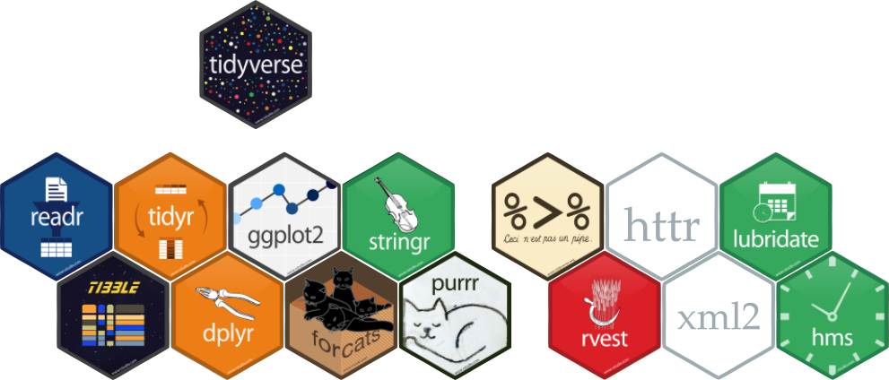
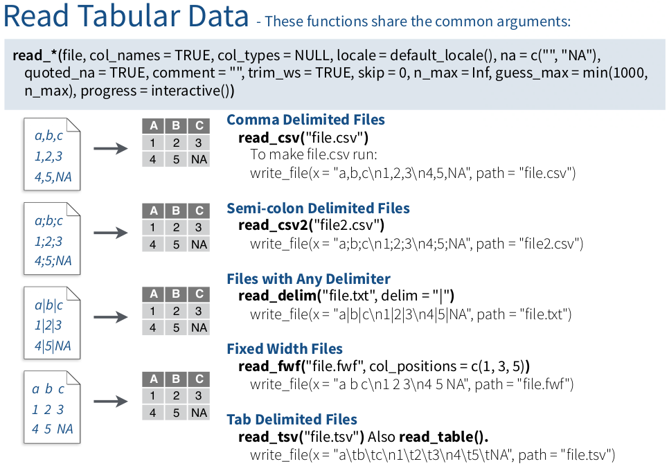
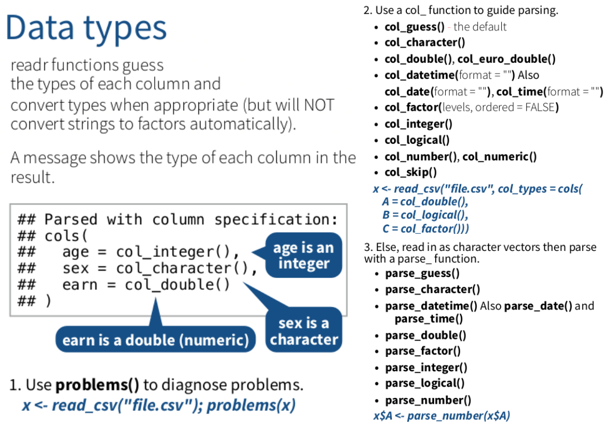
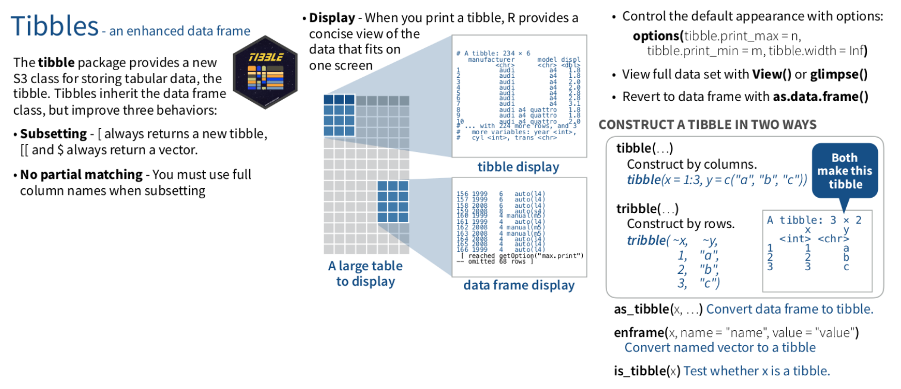
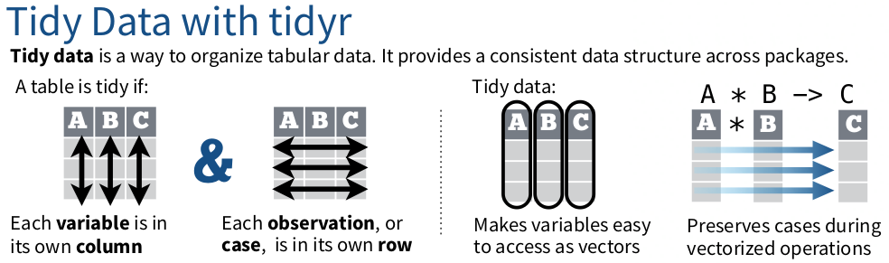
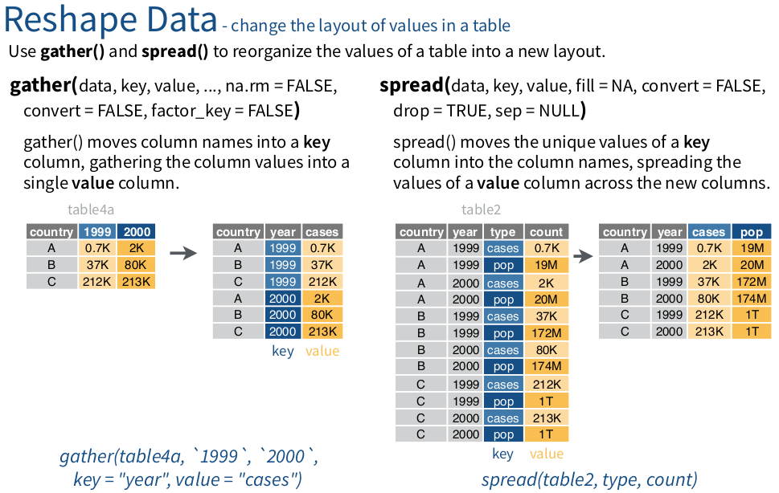
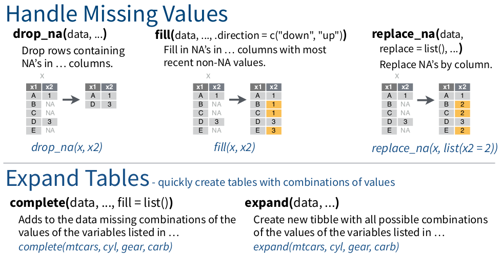
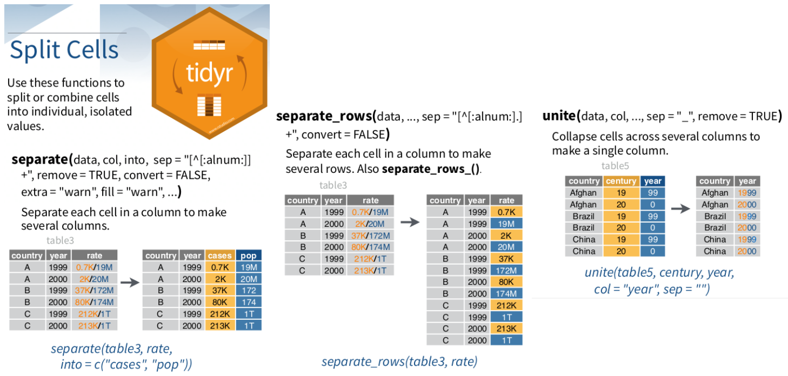

```{r, include = FALSE}
source("config/setup.R")
```

# Motivação

## O ambiente R para manipulação de dados

  * O R é a lingua franca da Estatística.
  * Desde o princípio oferece recursos para manipulação de dados.
    * O `data.frame` é a estrutura base para dados tabulares.
    * `base`, `utils`, `stats`, `reshape`, etc com recursos para ler,
      transformar, modificar, filtrar, agregar, `data.frame`s.
  * Porém, existem "algumas imperfeições":
    * Coerções indesejadas de `data.frame`/matriz para vetor.
    * Ordem/nome irregular/inconsistente dos argumentos nas funções.
    * Dependência de pacotes apenas em cascata.

# A abordagem `tidyverse`

## O `tidyverse`

  * Oferece uma reimplementação e extensão das funcionalidades para
    manipulação e visualização.
  * É uma coleção 8 de pacotes R que operam em harmonia.
  * Eles foram planejados e construídos para trabalhar em conjunto.
  * Possuem gramática, organização, filosofia e estruturas de dados
    mais clara.
  * Maior facilidade de desenvolvimento de código e portabilidade.
  * Pacotes: <https://www.tidyverse.org/packages/>.
  * <https://rstudio-education.github.io/tidyverse-cookbook/program.html>.
  * Outros pacotes acoplam muito bem com o `tidyverse`.

```{r, results = "hide", message = FALSE}
library(tidyverse)
ls("package:tidyverse")
tidyverse_packages()
```

## O `tidyverse`

```{r, echo = FALSE, out.width = "10 cm", fig.cap = cap}
cap <- "Pacotes que fazer parte do \\texttt{tidyverse}."

```

## A anatomia do `tidyverse`

### `readr`

  * <https://readr.tidyverse.org/>.
  * Leitura de dados tabulares: csv, tsv, fwf.
  * Recursos "inteligentes" que determinam tipo de variável.
  * Ex: importar campos de datas como datas!

### `tibble`

  * <https://tibble.tidyverse.org/>.
  * Uma reimplementação do `data.frame` com muitas melhorias.

## A anatomia do `tidyverse`

### `tidyr`

  * <https://tidyr.tidyverse.org/>.
  * Suporte para criação de dados no formato `tidy` (tabular).
    * Cada variável está em uma coluna.
    * Cada observação (unidade amostral) é uma linha.
    * Cada valor é uma cédula.

### `dplyr`

  * <https://dplyr.tidyverse.org/>.
  * Oferece uma gramática pra manipulação de dados.
  * Operações de *split-apply-combine*.
  * Na maior parte da manipulação é usado o `dplyr`.

## A anatomia do `tidyverse`

### `ggplot2`

  * <https://ggplot2.tidyverse.org/>.
  * Criação de gráficos baseado no *grammar of graphics*.
  * Claro mapeamento de variáveis em elementos visuais e contrução
    baseada em camadas.

### `forcats`

  * <https://forcats.tidyverse.org/>.
  * Para manipulação de variáveis categóricas/fatores.

## A anatomia do `tidyverse`

### `stringr`

  * <https://stringr.tidyverse.org/>.
  * Recursos coesos construídos para manipulação de *strings*.

### `purrr`

  * <https://purrr.tidyverse.org/>.
  * Recursos para programação funcional.

## Harmonizam bem com o `tidyverse`

  * [`magrittr`](https://magrittr.tidyverse.org/):
    operadores *pipe* $\rightarrow$ `%>%`.
  * [`rvest`](https://rvest.tidyverse.org/): *web scraping*.
  * [`httr`](https://cran.r-project.org/package=httr): requisições HTTP e afins.
  * [`xml2`](https://cran.r-project.org/package=xml2): manipulação de XML.
  * [`lubridate`](https://lubridate.tidyverse.org/) e [`hms`](https://hms.tidyverse.org/): manipulação de dados cronológicos.

# Leitura de dados com `readr`

## Anatomia do `readr`

```{r}
# packageVersion("readr")
ls("package:readr") %>%
    str_subset("(read|parse|write)_") %>%
    sort()
```

## Cartão de referência

  * Cartão de leitura com o `readr` e arrumação com o `tidyr`:
  <https://rawgit.com/rstudio/cheatsheets/master/data-import.pdf>.
  * Exemplos de leitura de dados com o `readr`: <http://leg.ufpr.br/~walmes/cursoR/data-vis/99-datasets.html>.

---

```{r, echo = FALSE, out.width = "10 cm", fig.cap = cap}
cap <- "Leitura com o \\texttt{readr}."

```

---

```{r, echo = FALSE, out.width = "10 cm", fig.cap = cap}
cap <- "Parsing de valores com \\texttt{readr}."

```

# O `tibble`

## Anatomia do `tibble`

```{r}
# packageVersion("tibble")
ls("package:tibble")
```

---

```{r, echo = FALSE, out.width = "11 cm", fig.cap = cap}
cap <- "Uso do \\texttt{tibble}."

```

# Dados no formato `tidy` com `tidyr`

## Anatomia do `tidyr`

```{r}
# packageVersion("tidyr")
ls("package:tidyr")
```

---

```{r, echo = FALSE, out.width = "11 cm", fig.cap = cap}
cap <- "A definição de \\textit{tidy data} ou formato tabular."

```

---

```{r, echo = FALSE, out.width = "11 cm", fig.cap = cap}
cap <- "Modificação da disposição dos dados com o \\texttt{tidyr}."

```

---

```{r, echo = FALSE, out.width = "11 cm", fig.cap = cap}
cap <- "Recursos para lidar com dados ausentes do \\texttt{tidyr}."

```

---

```{r, echo = FALSE, out.width = "11 cm", fig.cap = cap}
cap <- "Partir e concatenar valores com \\texttt{tidyr}."

```

# Agregação com `dplyr`

# Programação funcional com `purrr`

# Gráficos com `ggplot2`

## Referências
