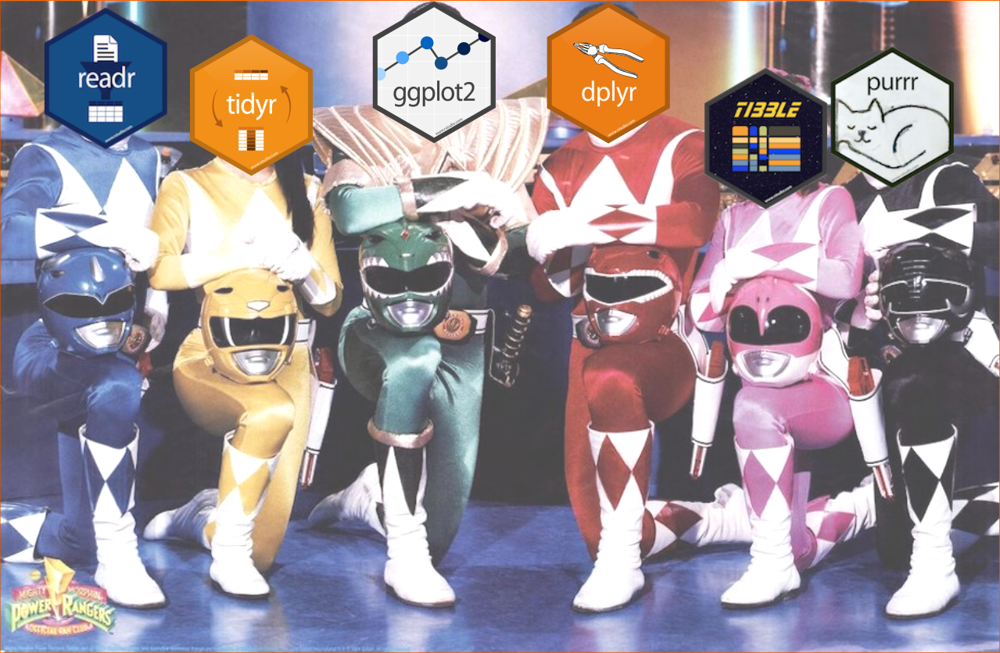

```{r, include = FALSE}
source("config/setup.R")
```

# Motivação

## Manipulação e visualização de dados

  * Manipular e visualizar dados são tarefas **obrigatórias** em Data
    Science (DS).
  * O conhecimento sobre dados **determina o sucesso** das etapas
    seguintes.
  * Fazer isso de forma eficiente requer:
    * Conhecer o processo e suas etapas.
    * Dominar a tecnologia para isso.
  * Existem inúmeros softwares voltados para isso.
  * R se destaca em DS por ser *free & open source*, ter muitos recursos
    e uma ampla comunidade.

## O tempo gasto em DS

```{r, include = FALSE}
library(tidyverse)

tm <- c(
  "Coletar dados" = 19,
  "Limpar e organizar dados" = 60,
  "Minerar de dados" = 9,
  "Construir dados de treino" = 3,
  "Refinar algorítmos" = 4,
  "Outros" = 5) %>%
    enframe(value = "time")
te <- c(
  "Coletar dados" = 21,
  "Limpar e organizar dados" = 57,
  "Minerar de dados" = 3,
  "Construir dados de treino" = 10,
  "Refinar algorítmos" = 4,
  "Outros" = 5) %>%
    enframe(value = "enjoy")

tme <- inner_join(tm, te) %>%
    gather(key = "ativ", value = "value", -name) %>%
    mutate(
        ativ = fct_relevel(ativ, "time", "enjoy"),
        ativ = fct_recode(factor(ativ),
                          "Tempo gasto" = "time",
                          "Menos divertido" = "enjoy"),
        name = str_c(1:6, ". ", name))
str(tme)

gg <- ggplot(tme, aes(x = "", y = value, fill = name))+
    facet_wrap(facets = ~ativ) +
    geom_col(color = "black") +
    coord_polar("y", start = pi/2,  direction = 1) +
    geom_text(aes(label = paste0(value, "%")),
              position = position_stack(vjust = 0.5)) +
    ggtitle("O que os cientistas de dados mais gastam tempo\nfazendo e como gostam disso?") +
    labs(fill = "Atividade") +
    xlab(NULL) +
    ylab(NULL)
```
```{r, echo = FALSE, out.width = "11cm", fig.cap = cap}
cap <- "Tempo gasto e diversão em atividades. Fonte: \\href{https://www.forbes.com/sites/gilpress/2016/03/23/data-preparation-most-time-consuming-least-enjoyable-data-science-task-survey-says}{Gil Press, 2016}."
gg
```

## O ambiente R para manipulação de dados

  * O R é a lingua franca da Estatística.
  * Desde o princípio oferece recursos para manipulação de dados.
    * O `data.frame` é a estrutura base para dados tabulares.
    * `base`, `utils`, `stats`, `reshape`, etc com recursos para
      importar, transformar, modificar, filtrar, agregar, `data.frame`s.
  * Porém, existem "algumas imperfeições" ou espaço para melhorias:
    * Coerções indesejadas de `data.frame`/matriz para vetor.
    * Ordem/nome irregular/inconsistente dos argumentos nas funções.
    * Dependência de pacotes apenas em cascata.

# A abordagem `tidyverse`

## O `tidyverse`

  * Oferece uma **reimplementação e extensão** das funcionalidades para
    manipulação e visualização.
  * É uma coleção **8 de pacotes** R que operam em harmonia.
  * Eles foram planejados e construídos para trabalhar em conjunto.
  * Possuem gramática, organização, filosofia e estruturas de dados
    mais clara.
  * Maior facilidade de desenvolvimento de código e portabilidade.
  * Outros pacotes acoplam muito bem com o `tidyverse`.
  * Pacotes: <https://www.tidyverse.org/packages/>.
  * **R4DS**: <https://r4ds.had.co.nz/>.
  * Cookbook: <https://rstudio-education.github.io/tidyverse-cookbook/program.html>.

## O que o `tidyverse` contém

```{r, message = FALSE}
library(tidyverse)
ls("package:tidyverse")
tidyverse_packages()
```

## Os pacotes do `tidyverse`

```{r, echo = FALSE, out.width = "10 cm", fig.cap = cap}
cap <- "Pacotes que fazer parte do \\texttt{tidyverse}."
knitr::include_graphics("img/tidyverse-packages.png")
```

## Mas na realidade

```{r, echo = FALSE, out.width = "10 cm", fig.cap = cap}
cap <- "Em um universo pararelo."

```

## A anatomia do `tidyverse`

### `tibble`

  * Uma reimplementação do `data.frame` com muitas melhorias.
  * Método `print()` enxuto.
  * Documentação: <https://tibble.tidyverse.org/>.

### `readr`

  * Leitura de dados tabulares: csv, tsv, fwf.
  * Recursos "inteligentes" que determinam tipo de variável.
  * Ex: importar campos de datas como datas!
  * Documentação: <https://readr.tidyverse.org/>.

## A anatomia do `tidyverse`

### `tidyr`

  * Suporte para criação de dados no formato `tidy` (tabular).
    * Cada variável está em uma coluna.
    * Cada observação (unidade amostral) é uma linha.
    * Cada valor é uma cédula.
  * Documentação: <https://tidyr.tidyverse.org/>.

### `dplyr`

  * Oferece uma gramática extensa pra manipulação de dados.
  * Operações de *split-apply-combine*.
  * Na maior parte da manipulação é usado o `dplyr`.
  * Documentação: <https://dplyr.tidyverse.org/>.

## A anatomia do `tidyverse`

### `ggplot2`

  * Criação de gráficos baseado no *The Grammar of Graphics*
    [@wilkinson2013grammar].
  * Claro mapeamento das variáveis do BD em variáveis visuais e
    construção baseada em camadas.
  * Documentação: <https://ggplot2.tidyverse.org/>.
  * @wickham2016ggplot2: `ggplot2` - Elegant Graphics for Data Analysis.
  * @teutonico2015ggplot2: `ggplot2` Essentials.

### `forcats`

  * Para manipulação de variáveis categóricas/fatores.
    * Renomenar, reordenar, transformar, aglutinar.
  * Documentação: <https://forcats.tidyverse.org/>.

## A anatomia do `tidyverse`

### `stringr`

  * Recursos coesos construídos para manipulação de *strings*.
  * Feito sobre o `stringi`.
  * Documentação: <https://stringr.tidyverse.org/>.

### `purrr`

  * Recursos para **programação funcional**.
  * Funções que aplicam funções em lote varrendo objetos: vetores,
    listas, etc.
  * Documentação: <https://purrr.tidyverse.org/>.

## Harmonizam bem com o `tidyverse`

  * [`magrittr`](https://magrittr.tidyverse.org/):
    operadores *pipe* $\rightarrow$ `%>%`.
  * [`rvest`](https://rvest.tidyverse.org/): *web scraping*.
  * [`httr`](https://cran.r-project.org/package=httr): requisições HTTP
    e afins.
  * [`xml2`](https://cran.r-project.org/package=xml2): manipulação de
    XML.
  * [`lubridate`](https://lubridate.tidyverse.org/) e
    [`hms`](https://hms.tidyverse.org/): manipulação de dados
    cronológicos.

# Estruturas de dados do `tibble`

## Anatomia do `tibble`

  * Aperfeiçoamento do `data.frame`.
  * A classe `tibble`.
  * Formas ágeis de criar `tibble`s.
  * Formas ágeis de modificar objetos das classes.
  * Método print mais enxuto e informativo.

---

```{r}
# packageVersion("tibble")
ls("package:tibble")
```

---

```{r, echo = FALSE, out.width = "11 cm", fig.cap = cap}
cap <- "Uso do \\texttt{tibble}."
knitr::include_graphics("img/tibbles.png")
```

# Leitura de dados com `readr`

## Anatomia do `readr`

  * Importação de dados no formato texto.
    * Funções de importação: `read_*()`.
    * Funções de escrita: `write_*()`.
    * Funções de *parsing*: `parse_*`.
  * Conseguem identificar campos de data.
  * Muitas opções de controle de importação:
    * Encoding.
    * Separador de campo e decimal.
    * Aspas, comentários, etc.
  * Cartão de leitura com o `readr` e arrumação com o `tidyr`:
    <https://rawgit.com/rstudio/cheatsheets/master/data-import.pdf>.
  * Exemplos do curso de leitura de dados com o `readr`:
    <http://leg.ufpr.br/~walmes/cursoR/data-vis/99-datasets.html>.

---

```{r}
# packageVersion("readr")
ls("package:readr") %>%
    str_subset("(read|parse|write)_") %>%
    sort()
```

---

\vspace{-1.5em}
\begin{figure}
\includegraphics[page=1, width=11cm]{img/data-import.pdf}
\caption{Cartão de referência importação de dados com o \texttt{readr}.}
\end{figure}

---

```{r, echo = FALSE, out.width = "10 cm", fig.cap = cap}
cap <- "Leitura com o \\texttt{readr}."
knitr::include_graphics("img/readr-read.png")
```

---

```{r, echo = FALSE, out.width = "10 cm", fig.cap = cap}
cap <- "Parsing de valores com \\texttt{readr}."
knitr::include_graphics("img/readr-parse.png")
```

# Dados no formato `tidy` com `tidyr`

## Anatomia do `tidyr`

  * Para fazer arrumação dos dados.
  * Mudar a disposição dos dados: *long* $\rightleftharpoons$ *wide*.
  * Partir uma variável em vários campos.
  * Concatenar vários campos para criar uma variável.
  * Remover ou imputar os valores ausentes: `NA`.
  * Aninhar listas em tabelas: `tribble`.

---

```{r}
# packageVersion("tidyr")
ls("package:tidyr")
```

---

\vspace{-1.5em}
\begin{figure}
\includegraphics[page=2, width=11cm]{img/data-import.pdf}
\caption{Cartão de referência arrumação de dados com \texttt{tidyr}.}
\end{figure}

---

```{r, echo = FALSE, out.width = "11 cm", fig.cap = cap}
cap <- "A definição de \\textit{tidy data} ou formato tabular."
knitr::include_graphics("img/tidyr-tidydata.png")
```

---

```{r, echo = FALSE, out.width = "11 cm", fig.cap = cap}
cap <- "Modificação da disposição dos dados com o \\texttt{tidyr}."
knitr::include_graphics("img/tidyr-reshape.png")
```

---

```{r, echo = FALSE, out.width = "11 cm", fig.cap = cap}
cap <- "Recursos para lidar com dados ausentes do \\texttt{tidyr}."
knitr::include_graphics("img/tidyr-missing.png")
```

---

```{r, echo = FALSE, out.width = "11 cm", fig.cap = cap}
cap <- "Partir e concatenar valores com \\texttt{tidyr}."
knitr::include_graphics("img/tidyr-split.png")
```

# Agregação com `dplyr`

## Anatomia do `dplyr`

  * O `dplyr` é a **gramática** para manipulação de dados.
  * Tem um conjunto **consistente** de verbos para atuar sobre tabelas.
    * Verbos: `mutate()`, `select()`, `filter()`, `arrange()`, `summarise()`, `slice()`, `rename()`, etc.
    * Sufixos: `_at()`, `_if()`, `_all()`, etc.
    * Agrupamento: `group_by()` e `ungroup()`.
    * Junções: `inner_join()`, `full_join()`, `left_join()` e `right_join()`.
    * Funções resumo: `n()`, `n_distinct()`, `first()`, `last()`, `nth()`, etc.
    * E muito mais no cartão de referência.
  * Cartão de referência: <https://github.com/rstudio/cheatsheets/raw/master/data-transformation.pdf>.
  * É sem dúvida **o pacote mais importante** do `tidyverse`.

---

```{r}
# library(dplyr)
ls("package:dplyr") %>% str_c(collapse = ", ") %>% strwrap()
```

---

\vspace{-1.5em}
\begin{figure}
\includegraphics[page=1, width=11cm]{img/data-transformation.pdf}
\caption{Cartão de referência de operações em dados com tabulares com \texttt{dplyr}.}
\end{figure}

---

\vspace{-1.5em}
\begin{figure}
\includegraphics[page=2, width=11cm]{img/data-transformation.pdf}
\caption{Cartão de referência de operações em dados com tabulares com \texttt{dplyr}.}
\end{figure}

# Programação funcional com `purrr`

## Anatomia do `purrr`

  * O `purrr` fornece um conjunto **completo e consistente** para
    **programação funcional**.
  * São uma sofisticação da *família `apply`*.
  * Várias função do tipo `map` para cada tipo de input/output.
  * Percorrem vetores, listas, colunas, linhas, etc.
  * Permitem filtar, concatenar, parear listas, etc.
  * Tem funções para tratamento de exceções: falhas/erros, avisos.
  * Cartão de referência: <https://github.com/rstudio/cheatsheets/raw/master/purrr.pdf>.

---

```{r}
# library(purrr)
ls("package:purrr") %>% str_c(collapse = ", ") %>% strwrap()
```

---

\vspace{-1.5em}
\begin{figure}
\includegraphics[page=1, width=11cm]{img/purrr.pdf}
\caption{Cartão de referência de programação funcional com \texttt{purrr}.}
\end{figure}

---

\vspace{-1.5em}
\begin{figure}
\includegraphics[page=2, width=11cm]{img/purrr.pdf}
\caption{Cartão de referência de programação funcional com \texttt{purrr}.}
\end{figure}

# Gráficos com `ggplot2`

## Anatomia do `ggplot2`

  * O `ggplot2` é o pacote gráfico mais adotado em ciência de dados.
  * Sua implementação é baseada no *The Gammar of Graphics*
    [@wilkinson2013grammar].
  * A gramática faz com que a construção dos gráficos seja por camadas.
  * Cartão de referência: <https://github.com/rstudio/cheatsheets/raw/master/data-visualization-2.1.pdf>.
  * Um tutorial de `ggplot2` apresentado no [R Day](http://rday.leg.ufpr.br/materiais.html):
    <http://rday.leg.ufpr.br/materiais/intro_ggplo2_tomas.pdf>.

---

\vspace{-1.5em}
\begin{figure}
\includegraphics[page=1, width=11cm]{img/data-visualization.pdf}
\caption{Cartão de referência de gráficos com \texttt{ggplot2}.}
\end{figure}

---

\vspace{-1.5em}
\begin{figure}
\includegraphics[page=2, width=11cm]{img/data-visualization.pdf}
\caption{Cartão de referência de gráficos com \texttt{ggplot2}.}
\end{figure}

---

```{r}
u <- ls("package:ggplot2")
u %>% str_subset("^geom_")
u %>% str_subset("^theme_")
```

---

```{r}
u %>% str_subset("^stat_")
u %>% str_subset("^(scale|coord)_")
```

# Manipulação de strings com `stringr`

## Anatomia do `stringr`

  * O `stringr` é uma coleção de funções para operações com strings.
  * Ele foi construído sobre o `stringi`.
  * Cartão de referência: <https://github.com/rstudio/cheatsheets/raw/master/strings.pdf>.

---

```{r}
ls("package:stringr")
```

---

\vspace{-1.5em}
\begin{figure}
\includegraphics[page=1, width=11cm]{img/strings.pdf}
\caption{Cartão de referência para manipulação de strings com \texttt{stringr}.}
\end{figure}

---

\vspace{-1.5em}
\begin{figure}
\includegraphics[page=2, width=11cm]{img/strings.pdf}
\caption{Cartão de referência para manipulação de strings com \texttt{stringr}.}
\end{figure}

# Manipulação de fatores com `forcats`

## Anatomia do `forcats`

  * O `forcats` é uma coleção de funções para operações com fatores.
  * Permite renomear, reordenar, aglutinar níveis, etc.
  * Cartão de referência: <https://github.com/rstudio/cheatsheets/raw/master/factors.pdf>.

```{r}
ls("package:forcats")
```

---

\vspace{-1.5em}
\begin{figure}
\includegraphics[page=1, width=11cm]{img/factors.pdf}
\caption{Cartão de referência para manipulação de factores com \texttt{forcats}.}
\end{figure}

# Dados cronológicos com `lubridate` e `hms`

## Anatomia dos pacotes

  * Recursos para manipulação de dados *date-time*.
  * Fácil decomposição de datas: dia, mês, semana, dia da semana, etc.
  * Lida com fusos horários, horários de verão, etc.
  * Extende para outras classes de dados baseados em *date-time*:
    duração, período, intervalos.
  * Cartão de referência: <https://rawgit.com/rstudio/cheatsheets/master/lubridate.pdf>.
  * **Não** é carregado junto com o `tidyverse`.

---

```{r, message = FALSE}
library(lubridate)
ls("package:lubridate") %>% str_c(collapse = ", ") %>% strwrap()
```

---

\vspace{-1.5em}
\begin{figure}
\includegraphics[page=1, width=11cm]{img/lubridate.pdf}
\caption{Cartão de referência para manipulação de *date-time* com \texttt{lubridate} e \texttt{hms}.}
\end{figure}

---

\vspace{-1.5em}
\begin{figure}
\includegraphics[page=2, width=11cm]{img/lubridate.pdf}
\caption{Cartão de referência para manipulação de *date-time* com \texttt{lubridate} e \texttt{hms}.}
\end{figure}

# Encadeando operações com o *pipe* do `magrittr`

## Anatomia do `magrittr`

  * O operador permite expressar de forma mais direta as operações.
  * É uma ideia inspirada no Shell.
  * A lógica é bem simples:
    * `x %>% f` é o mesmo que `f(x)`.
    * `x %>% f(y)` é o mesmo que `f(x, y)`.
    * `x %>% f %>% g %>% h` é o mesmo que `h(g(f(x)))`.

## Anatomia do `magrittr`

```{r, message = FALSE}
library(magrittr)

# Operadores "pipe".
ls("package:magrittr") %>%
    str_subset("%")

# Outras funções/objetos.
ls("package:magrittr") %>%
    str_subset("^[^%]*$")
```

## Exemplos do uso do pipe (1)

```{r}
x <- precip
mean(sqrt(x - min(x)))

x <- x - min(x)
x <- sqrt(x)
mean(x)

precip %>%
    `-`(min(.)) %>% # o mesmo que subtract(min(.))
    sqrt() %>%
    mean()
```

## Exemplos de uso do pipe (2)

```{r}
x <- precip
x <- sqrt(x)
x <- x[x > 5]
x <- mean(x)
x

precip %>%
    sqrt() %>%
    .[is_greater_than(., 5)] %>% # o mesmo que .[`>`(., 5)]
    mean()
```

# Mãos à obra!

## Instalar o `tidyverse`

```{r, eval = FALSE}
# Do CRAN.
install.packages("tidyverse")

# Do GitHub.
# install.packages("devtools")
devtools::install_github("hadley/tidyverse")

# Atualizar caso já tenha instalado.
tidyverse_update()
```

## O que vem agora?

  * Uma visão aprofundada de cada pacote do `tidyverse`.
  * Exemplos didáticos seguidos de desafios práticos.
  * *Happy coding*.

## Referências
