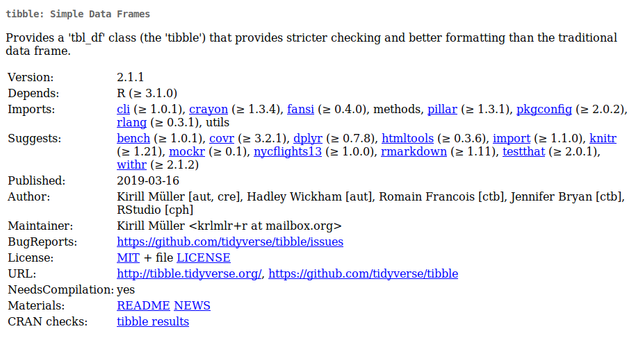

```{r, include = FALSE}
source("config/setup.R")
```

# Um overview do `tibble`

## Motivação

  * O `data.frame` é a estrutura nativa (primitiva) para representar
    tabelas de dados.
  * O `tibble` é uma reimplementação da estrutura com melhorias.
    * Método print mais enxuto e informativo.
    * Mais consistente para seleção e modificação de conteúdo.
    * Mais fácil conversão de outros formatos para `tibble`.
    * Colunas/cédulas podem representar objetos mais complexos.
  * Documentação:
    * <https://tibble.tidyverse.org/>.
    * <https://r4ds.had.co.nz/tibbles.html>.
    * <https://cran.r-project.org/package=tibble>

## A ficha técnica

```{r, echo = FALSE, out.width = "10.5 cm", fig.cap = cap}
cap <- "Ficha técnica do \\texttt{tibble}. Fonte: \\url{}."

```

## Formas de criar um `tibble`

### Criação por especificação de colunas (*column-by-column*)

```{r, message = FALSE}
library(tidyverse)
# packageVersion("tibble")
```

```{r}
tb <- tibble(x = 1:3, y = letters[1:length(x)], z = x^2)
tb
```

## Formas de criar um `tibble`

### Criação por especificação de linhas (`row-by-row`)

```{r}
tribble(
  ~x, ~y,  ~z,
  "a", 2,  3.6,
  "b", 1,  8.5
)
```

## Formas de criar um `tibble`

### Coerção de vetores nomeados

```{r}
notas <- c("André" = 6, "Larissa" = 9, "Mariana" = 8, "Tobias" = 3)
notas <- notas %>%
    enframe(name = "aluno", value = "nota")
notas
```

## Formas de criar um `tibble`

### Coerção de matrizes

```{r}
matrix(1:12, ncol = 3) %>%
    as_tibble()

```

## Formas de criar um `tibble`

### Coerção de `data.frame`s

```{r}
iris %>%
    as_tibble()
```

## Formas de criar um `tibble`

### Usando objetos de classe diferente

```{r}
# lv <- iris$Species %>% unique()
# lv <- iris %$% Species %>% unique()
lv <- iris %>% distinct(Species) %>% pull()
vals <- by(data = iris[, -5], INDICES = iris$Species, FUN = as.matrix)
tibble(Species = lv, Data = vals)
```

## Métodos disponíveis para a classe

```{r}
tb <- as_tibble(iris)
class(tb)

methods(class = "tbl")
methods(class = "tbl_df")
```

## Operações com `tibble`

### Seleção

```{r, results = "hide"}
tb <- iris[1:4, ] %>%
    as_tibble()

# Resulta em vetor.
tb$Petal.Length
tb[["Petal.Length"]]
tb[[3]]

# Resulta em `tibble`!
tb[, 3]
tb[, "Petal.Length"]
tb[, c(3:4)]
tb[1, ]
```

## Operações com `tibble`

### Adicionar colunas

```{r}
notas <- c("André" = 6, "Larissa" = 9, "Mariana" = 8, "Tobias" = 3)
notas <- notas %>% enframe(name = "aluno", value = "nota")

notas <- notas %>%
    add_column(faltas = c(12, 8, 0, 18))
notas
```

## Operações com `tibble`

### Adicionar linhas

```{r}
notas <- notas %>%
    add_row(aluno = c("Roberto", "Sabrina"),
            nota = c(8, 7))
notas
```

# Exercícios para usar o `tibble`

---

Criar um `tibble` a partir:

  1. do objeto `precip`.
  2. do objeto `cars`.
  3. do objeto `mtcars`.
  4. do objeto `anscombe` com 3 colunas: `grupo`, `x` e `y`.
  5. do objeto `WorldPhones`.
  6. do objeto `HairEyeColor`.
  7. dos dados exibidos nos dois *donet plot* em
     <http://www.vizwiz.com/2016/06/data-scientists-need-alteryx.html>
     com 6 linhas e 3 colunas: `tarefa`, `tempo`, `enfado`.
  8. dos dados disponíveis em <http://leg.ufpr.br/~walmes/data/bib1.txt>
     usando `tribble()`.

<!-- ## Referências -->
