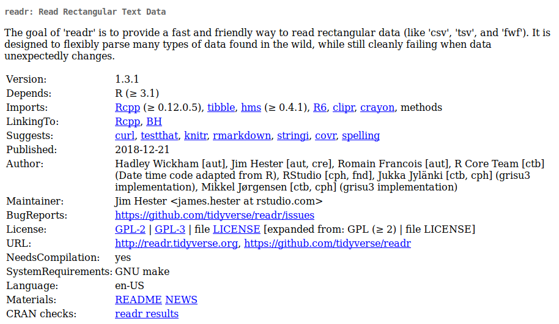

```{r, include = FALSE}
source("config/setup.R")
```

# Um overview do `readr`

## Motivação

  * O processo de análise de dados começa com a importação dos dados
    para o ambiente de manipulação.
  * Existem várias meios para armazenar dados.
    * Arquivos de texto pleno (tsv, txt, csv, etc).
    * Planilhas eletrônicas.
    * Bancos de dados relacionais.
    * Etc.
  * O `readr` tem recursos para importação de dados retangulares na
    forma de texto pleno.
  * Documentação:
    * <https://readr.tidyverse.org/>.
    * <https://r4ds.had.co.nz/data-import.html>.
    * <https://cran.r-project.org/package=readr>

## A ficha técnica

```{r, echo = FALSE, out.width = "10.5 cm", fig.cap = cap}
cap <- "Ficha técnica do \\texttt{readr}."

```

---

\vspace{-1.5em}
\begin{figure}
\includegraphics[page=1, width=11cm]{img/data-import.pdf}
\caption{Cartão de referência de importação de dados com o \texttt{readr}.}
\end{figure}

## Funções para importação

```{r, message = FALSE}
library(tidyverse)

ls("package:readr") %>% str_subset("^read_")
```

## Protótipo de argumentos da função

```{r}
# Argumentos da `read_csv()`.
args(read_csv)

# Argumentos da `locale()`.
args(locale)
```

## As funções de escrita

```{r}
ls("package:readr") %>% str_subset("^write_")

args(write_delim)
```

## As funções de parsing

  * Uma das maiores vantagens do `readr` é a maior flexibilidade para
    determinar o tipo de valor dos campos.
  * As funções para o *parsing* (exame) são usadas para atribuir o tipo
    de valor apropriado durante a importação.
  * Isso é economia de tempo.

```{r}
ls("package:readr") %>% str_subset("^parse_")
```

## As funções de parsing

```{r, results = "hide"}
# Conversão para data e data-tempo.
parse_date("2018/12/25")
parse_datetime("20181225")
parse_datetime("2018-12-25T12:10:00")

# Número com separador de milhar.
guess_parser("1,234,566")
parse_guess("1,234,566")

# Datas.
guess_parser(c("2010-10-10"))
parse_guess(c("2010-10-10"))
```

## Importação de dados com `readr`

  * O argumento obrigatório é o caminho para o arquivo.
  * Argumentos opcionais existem pra um controle detalhado das opções de
    importação.

```{r, results = "hide", message = FALSE}
url <- "http://leg.ufpr.br/~walmes/data/anovareg.txt"

# Default.
tb <- read_tsv(file = url)

# Tipo de valores para cada variável.
tb <- read_tsv(file = url, col_types = "cicd")

# Renomeia os campos.
tb <- read_tsv(file = url, col_names = c("clt", "ntr", "blc", "index"))
```

## Importação de dados com `readr`

  * A lista de especificações de tipo de valor garante que variáveis com
    certos nomes serão importadas com o tipo de valor definido.
  * Ou seja, em todo arquivo que houver `bloco`, ele será importado como
    fator.
  * Não precisa estar na ordem e nem conter todas as variáveis.

```{r, results = "hide"}
# Lista de especificações.
specs <- cols(
    cultivar = col_factor(levels = NULL),
    bloco = col_factor(levels = NULL)
    # dose = col_integer(),
    # indice = col_integer()
)

# Usando a lista.
tb <- read_tsv(file = url, col_types = specs)
str(tb)
```

## Importação de dados com `readr`

  * Funções da `readr` produzem `tibble`s.
  * Não importam string como fator, apenas por especificação.

```{r}
attr(tb, "spec") <- NULL
str(tb)
```

## Exportação de dados com `readr`

```{r}
ls("package:readr") %>% str_subset("^write_")
```

```{r, eval = FALSE}
write_csv(iris, path = "iris_dataset.csv")
```

# Exercícios para usar o `readr`

---

No diretório de arquivos web <http://leg.ufpr.br/~walmes/data/>,
importar os dados dos arquivos:

  1. `irmpa.csv`.
  2. `frango_comportamento.txt`.
  3. `soja.txt`.
  4. `compingest.txt`.
  5. `carros_venda_webmotors_270314.txt`.
  6. `metereologia.txt`.
  7. `aval_carros_fwf.txt`. São 16 campos. Exceto o primeiro, 15 últimos
     campos são de 2 dígitos.

<!-- ## Referências -->
