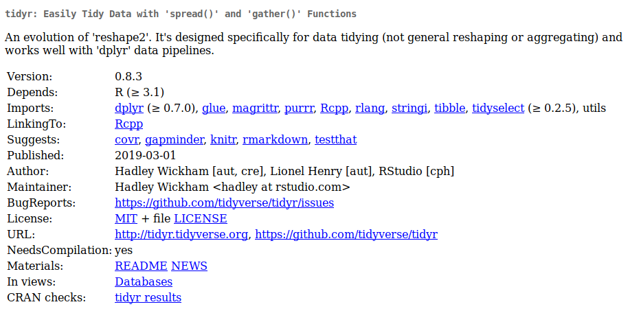

```{r, include = FALSE}
source("config/setup.R")
```

# Um overview do `tidyr`

## Motivação

  * A maior parte das etapas de análise de dados assume que os dados
    estão arrumados:
    * Cada coluna é uma variável/atributo/campo.
    * Cada linha é uma observação/caso/instância/tupla.
    * Cada cédula é o registro de uma variável de uma observação.
  * Situações que fogem a regra:
    * Disposição no formato longo ou amplo.
    * Colunas com valores concatenados.
    * Registros com valores ausentes.

## O `tidyr`

  * O `tidyr` contém recursos para arrumação dos dados.
    * Mudança de disposição dos dados.
    * Substituição de missings.
    * Separação e união de campos.
  * Documentação:
    * <https://tidyr.tidyverse.org/>.
    * <https://r4ds.had.co.nz/tidy-data.html>.
    * <https://cran.r-project.org/package=tidyr>

## A ficha técnica

```{r, echo = FALSE, out.width = "10.5 cm", fig.cap = cap}
cap <- "Ficha técnica do \\texttt{tidyr}."

```

---

\vspace{-1.5em}
\begin{figure}
\includegraphics[page=2, width=11cm]{img/data-import.pdf}
\caption{Cartão de referência arrumação de dados com \texttt{tidyr}.}
\end{figure}

## Funções do pacote

```{r, message = FALSE}
library(tidyverse)

ls("package:tidyr")
```

## Empilhar variáveis

  * Situação comum quando:
    * são feitas medidas repetidas no tempo.
    * dados de painel e/ou questionário.

```{r}
n <- 3
tb1 <- tibble("trat" = LETTERS[1:n],
              aval1 = rpois(n, 4),
              aval2 = rpois(n, 4),
              aval3 = rpois(n, 4))
tb1
```

## Empilhar variáveis

```{r}

tb2 <- tb1 %>%
    gather(key = "aval",
           value = "insetos",
           aval1:aval3)
tb2
```

## Desempilhar variável

  * É a operação inversa de empilhar.
  * Dados nessa disposição são menos comuns.

```{r}
tb2 %>%
    spread(key = "aval",
           value = "insetos")
```

## Separar variável

  * Muito comum quando um campo de texto é a união de várias
    informações.
  * Ex: datas, horas, endereços, etc.

```{r}
tb <- tibble(veiculo = c("Celta", "Gol", "Uno"),
             ano_mod = c("2011/2012", "2012/2012", "2015/2016"),
             local = c("Curitiba-PR", "Santos-SP", "Viçosa-MG"))

tb %>%
    separate(col = "ano_mod",
             into = c("ano", "modelo"),
             sep = "/",
             convert = TRUE) %>%
    separate(col = "local",
             into = c("cidade", "estado"),
             sep = "-")
```

## Unir variáveis

  * Quando vários campos precisam ser combinados para gerar uma
    informação.
  * Ex: datas, horas, endereços, nomes.

```{r}
tb <- tibble(dia = c(1, 5, 23, 16),
             mes = c(3, 6, 2, 9),
             ano = 2018)
tb %>%
    unite(col = "data", ano, mes, dia, sep = "-", remove = FALSE) %>%
    mutate(data = parse_date(data, format = "%Y-%m-%d"))
```

## Manuseio de valores ausentes

```{r}
tb <- tibble(jogador = 1:5,
             jogos = c(0, 1, 3, 1, 2),
             gols = c(NA, 0, 0, 2, 1),
             faltas = c(NA, 1, 1, 0, 0))

# tb %>%
#     drop_na()

tb %>%
    replace_na(list(gols = 0, faltas = 0))
```

## Cédulas com objetos complexos

```{r}
tb <- warpbreaks %>%
    as_tibble() %>%
    nest(breaks)
tb

tb <- iris %>%
    as_tibble() %>%
    nest(-Species)
tb
```

## Expandir combinações

  * Expandir combinações entre variáveis é necessário:
    * Para criar o desenho experimental de expermentos fatoriais.
    * Criar o grid para predição da resposta combinando todas as
      variáveis de entrada.

```{r}
tb <- crossing(blc = as.character(as.roman(1:2)),
               trt = LETTERS[1:3])
tb$prod <- rexp(tb$trt)
tb
```

## Expandir combinações

```{r}
tb <- tb[c(-1, -5, -6), ]
complete(tb, blc, trt)

expand(tb, blc, trt)
```

# Exercícios para usar o `tidyr`

---

  1. Ninfas em soja.
     1. Ler os dados em <http://leg.ufpr.br/~walmes/data/ninfas.txt>.
     2. Empilhar nos terços da planta.
     3. Desempilhar nas datas.
  2. Óleos essenciais.
     1. Ler o dados em <http://leg.ufpr.br/~walmes/data/oleos.txt>.
     2. Criar uma variável indicadora do registro: `1:nrow(tb)`.
     3. Empilhar nas avaliações, i.e, os 5 campos começados com `a`.
     4. Desempilhar na variável `forma` de aplicação.
  3. Futebol.
     1. Ler os dados em <http://leg.ufpr.br/~walmes/data/euro_football_players.txt>.
     2. Substituir os missings em `goal`, `red` e `yel` por 0.

---

  4. Avaliação de veículos.
     1. Ler os dados em
        <http://leg.ufpr.br/~walmes/data/aval_carros_nota.txt>.
     2. Desempilhar na variável `item` os valores de `nota`.
  5. Carros à venda.
     1. Ler os dados em
        <http://leg.ufpr.br/~walmes/data/duster_venda_260314.txt>.
     2. Separar os campos ano e modelo na variável `ano`. Ex:
        `2012/2013`.
     3. Substituir o `NA` em `km` percorrido pela média de km
        percorrido: `mean(..., na.rm = TRUE)`.
  6. Condição domicíliar dos municípios.
     1. Ler os dados em
        <http://leg.ufpr.br/~walmes/data/ipea_habitacao.csv>.
     2. Concatenar o nome do município com o nome do estado.

<!-- ## Referências -->
