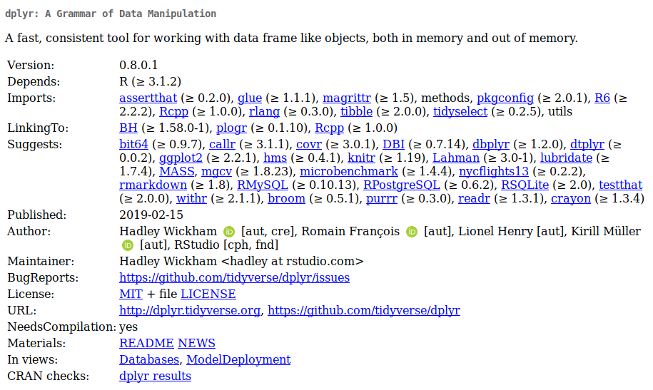

```{r, include = FALSE}
source("config/setup.R")
```

# Um overview do `dplyr`

## Motivação

  * Depois dos dados arrumados, é a hora começar conhecê-los!
  * Começa a fase de **análise exploratória de dados** (AED).
  * Os dados são explorados para:
    * Conhecer as (propriedades das) variáveis.
    * Determinar medidas descritivas.
    * Comparar grupos.
    * Quantificar relações entre variáveis.
    * Extrair padrões.
    * Detectar ameaças e corrigir problemas.
  * AED envolve inúmeras operações.
  * É preciso conhecê-las e ser criativo para aplicar da melhor forma.

## Detalhes do `dplyr`

  * O `dplyr` é a **gramática** para manipulação de dados.
  * Tem um conjunto **consistente** de verbos para atuar sobre tabelas.
    * Verbos: `mutate()`, `select()`, `filter()`, `arrange()`,
      `summarise()`, `slice()`, `rename()`, etc.
    * Sufixos: `_at()`, `_if()`, `_all()`, etc.
    * Agrupamento: `group_by()` e `ungroup()`.
    * Junções: `inner_join()`, `full_join()`, `left_join()` e
      `right_join()`.
    * Funções resumo: `n()`, `n_distinct()`, `first()`, `last()`,
      `nth()`, etc.
    * E muito mais no cartão de referência: <https://github.com/rstudio/cheatsheets/raw/master/data-transformation.pdf>.
  * Documentação:
    * <https://dplyr.tidyverse.org/>.
    * <https://r4ds.had.co.nz/relational-data.html>.
    * <https://cran.r-project.org/package=dplyr>

## A ficha técnica

```{r, echo = FALSE, out.width = "10.5 cm", fig.cap = cap}
cap <- "Ficha técnica do \\texttt{dplyr}."

```

---

\vspace{-1.5em}
\begin{figure}
\includegraphics[page=1, width=11cm]{img/data-transformation.pdf}
\caption{Cartão de referência de operações em dados com tabulares com \texttt{dplyr}.}
\end{figure}

---

\vspace{-1.5em}
\begin{figure}
\includegraphics[page=2, width=11cm]{img/data-transformation.pdf}
\caption{Cartão de referência de operações em dados com tabulares com \texttt{dplyr}.}
\end{figure}

# Ordenação

## Ordenação ascendente

```{r, message = FALSE}
library(tidyverse)

tb <- tibble(x = 1:4,
             y = c(4, 7, 1, 3),
             z = c(10, 10, 22, 22),
             k = c(TRUE, FALSE, FALSE, TRUE),
             u = c("A", "B", "A", "B"))

tb %>%
    arrange(z, y)
```

## Ordenação descendente

```{r}
tb %>%
    arrange(desc(z), -y)
```

# Seleções

## Filtro de linhas

```{r}
tb %>%
    filter(x > 2 | u == "A")
```

## Fatiar linhas

```{r}
tb %>% slice(1:3)
tb %>% slice(-(3:5))
```

## Sortear linhas

```{r}
tb %>% sample_n(size = 3)
tb %>% sample_frac(size = 0.5)
```

## Seleção de variáveis por listagem

```{r}
tb %>% select(x, y) # Inclusão.
tb %>% select(-z)   # Exclusão.
tb %>% select(y:k)  # Intervalo.
```

## Seleção por posição

```{r}
tb %>% select(3, 2, 1)
tb %>% select(-(1:2))
```

## Seleção de variáveis por condição

```{r}
tb %>% select_if(is.numeric)
tb %>% select_if(negate(is.numeric))
```

# Transformações

## Modificar uma variável

```{r}
tb %>%
    mutate(x = x * 2,
           u = as_factor(u))
```

## Criar variáveis uma variável

```{r}
tb %>%
    mutate(v = y * z^(x/4))
```

# Estatísticas resumo

## Medidas resumo gerais

```{r}
tb %>%
    summarise(x_mean = mean(x),
              y_median = median(y))

tb %>%
    summarise_if(.predicate = is.numeric, .funs = mean)

# tb %>% summarise_at(.vars = c("x", "y"), .funs = mean)
# tb %>% summarise_at(.vars = 1:3, .funs = mean)
tb %>%
    summarise_at(.vars = vars(x:z), .funs = mean)
```

## Medidas resumo vetoriais

```{r}
# Funções que retornam vetores.
# range(tb$x)
# fivenum(tb$x)

tb %>%
    summarise(x = list(range(x)),
              y = list(range(y))) %>%
    unnest()

tb %>%
    do(data_frame(x = range(.$x),
                  y = range(.$y)))

tb %>%
    summarise_if(is.numeric, function(s) list(range(s))) %>%
    unnest()
```

## Descrição global

  <https://dabblingwithdata.wordpress.com/2018/01/02/my-favourite-r-package-for-summarising-data/>

```{r, eval = FALSE}
Hmisc::describe(iris)
psych::describe(iris)
skimr::skim(iris)
```

```{r, eval = FALSE}
brotools::describe(iris)
summarytools::descr(iris)
summarytools::dfSummary(iris)
```

# Agregações

## Agrupando por variáveis estratificadoras

```{r}
tb %>%
    count(u)

tb %>%
    group_by(u) %>%
    summarise(x_mean = mean(x),
              y_range = max(y) - min(y),
              z_desv = sd(z))
```

```{r}
tb %>%
    group_by(u) %>%
    summarise_if(is.numeric, mean)

tb %>%
    group_by(u) %>%
    summarise_at(1:3, sum)
```

## Agrupando usando funções resumo vetoriais

```{r}
tb %>%
    group_by(u) %>%
    summarise_if(is.numeric, funs(min, median, max))

tb %>%
    group_by(u) %>%
    do(data_frame(stat = c("min", "q1", "median", "q3", "max"),
                  x = fivenum(.$x),
                  y = fivenum(.$y)))
```

# Junções

## Interseção

```{r}
tb1 <- tibble(aluno = c("Marcos", "Pedro", "Cintia", "Larissa", "Carla"),
              nota = c(10, 3, 6, 9, 10),
              faltas = c(3, 5, 6, 3, 0))
tb2 <- tibble(paciente = c("Pedro", "Larissa", "Marcos", "Lucas"),
              consulta = c("2017-02-23", "2019-01-30", "2018-12-10", "2018-11-20"),
              exame = c("sangue", "urina", NA, NA))

inner_join(tb1, tb2, by = c("aluno" = "paciente"))
```

## União

```{r}
full_join(tb1, tb2, by = c("aluno" = "paciente"))

```

## Junções parciais

```{r}
right_join(tb1, tb2, by = c("aluno" = "paciente"))
left_join(tb1, tb2, by = c("aluno" = "paciente"))
```

# Exercícios para usar o `dplyr`

## Ninfas em soja

  1. Ler os dados em <http://leg.ufpr.br/~walmes/data/ninfas.txt>.
  2. Ordenação.
     1. Ordenar pelo valor do terço `superior`.
     2. Ordenar pelo valor do terço `medio` de forma descrescente.
     3. Ordenar pelas datas $>$ variedade $>$ bloco.
  3. Filtros.
     1. Filtrar só para a variedade `BRS 245 RR`.
     2. Filtrar só para a variedade `BRS 245 RR` e `EMBRAPA 48`.
     3. Filtrar só para variedades diferentes de `EMBRAPA 48`.
     4. Filtrar quando `superior` com mais de 30 e inferior com mais
        de 20.
     5. Filtrar para `medio` entre 20 e 50.
     6. Filtrar para avaliações entre 2009-12-24 e 2010-01-11.
     7. Filtrar para a soma dos terços maior que 100.

---

  4. Fatias.
     1. As linhas 34, 74, 23 e 41.
     2. As 10 primeiras linhas.
     3. Da linha 50 até a 63.
     4. As últimas 10 linhas.
     5. Apenas a linhas com posição múltipla de 3.
     6. Remover as 100 primeiras linhas.
  5. Amostragem.
     1. Uma amostra de 30 linhas.
     2. Uma amostra de 30 linhas com reposição.
     3. Uma amostra de 10% das linhas.
     4. Pegar 20 registros com os maior número de ninfas no `superior`.

---

  6. Seleção de variáveis.
     1. Selecionar apenas os terços.
     2. Remover a variável bloco.
     3. Mudar a ordem das colunas finais para `inferior`, `medio` e
        `superior`.
     4. Manter as variáveis com nome terminado em `rior`.
  7. Modificação/criação de variáveis.
     1. Criar a variável total somando os terços.
     2. Criar a diferença entre o terço superior e inferior.
     3. Converter bloco e variedade para fator.
     4. Criar a raiz quadrada do número de ninfas em cada terço.

---

  8. Renomear.
     1. Renomear variedade para tratamento.
     2. Renomear os terços para versões abreviadas com 3 digitos.
     3. Passar todas as variáveis para caixa alta.
     4. Abreviar todas as variáveis para nomes com 3 digitos.
  9. Medidas descritivas gerais.
     1. Total de ninfas no terço superior.
     2. Total de ninfas em cada um dos terços.
     3. Média e desvio-padrão de ninfas em cada terço.
     4. Correlação do número de ninfas entre os terços (duas a duas).

---

  10. Medidas descritivas por extrato.
      1. Total de registros por variedade.
      2. Total de registros por data.
      3. Total de registros por variedade e data.
      4. Total de ninfas no terço superior por data.
      5. Total de ninfas nos 3 terços juntos por data.
      6. Total de ninfas nos 3 terços juntos por variedade, ordene no
         final.
      7. Total de ninfas nos 3 terços juntos por data e
         variedade. Guardar em objeto para usar a seguir.
      8. A variedade com mais ninfas em cada data.
      9. A data com mais ninfas em cada variedade.

<!-- ## Referências -->
