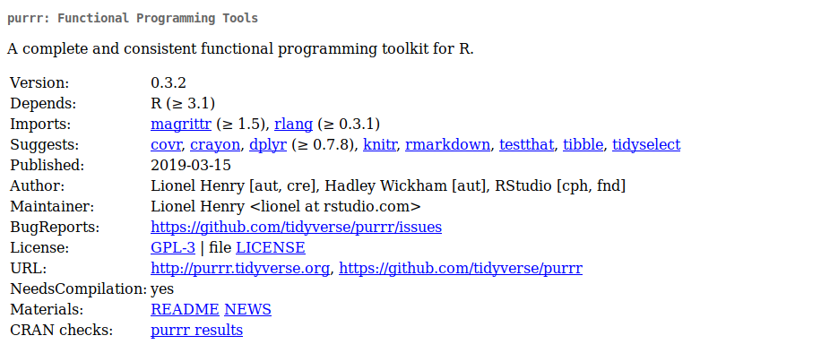

```{r, include = FALSE}
source("config/setup.R")
```

# Um overview do `purrr`

## Motivação

  * Programação funcional é quando uma função chama uma outra função
    para ser aplicada repetidamente percorrendo elementos de um objeto.
  * O recurso é útil para serializar tarefas.
  * Exemplos:
    * Análise de experimento em vários locais.
    * Análise de todas as respostas de um experimento.
    * Fazer o ajuste de regressão polinomial de grau 1 até 5.
    * Análise dos dados com diferentes transformações de variáveis.
    * Simulação computacional com diferentes delineamentos.
    * Importação de todos os datasets de um diretório.
    * Tratamento de todas as imagens de uma diretório.

## Programação funcional com `purrr`

  * No `tidyverse` a programação funcional está no `purrr`.
  * A principal é a função `map()` e suas variações.
  * Além disso, tem
    * Funções para tratamento de excessões.
    * Acumular e reduzir.
    * Aninhar e aplanar objetos.

## A ficha técnica

```{r, echo = FALSE, out.width = "10.5 cm", fig.cap = cap}
cap <- "Ficha técnica do \\texttt{purrr}."

```

---

\vspace{-1.5em}
\begin{figure}
\includegraphics[page=1, width=11cm]{img/purrr.pdf}
\caption{Cartão de referência dos recursos do \texttt{purrr}.}
\end{figure}

---

\vspace{-1.5em}
\begin{figure}
\includegraphics[page=2, width=11cm]{img/purrr.pdf}
\caption{Cartão de referência dos recursos do \texttt{purrr}.}
\end{figure}

# Funções `map*()`

## Aplicando uma função em série

```{r, message = FALSE}
library(tidyverse)
x <- list(1:5, c(4, 5, 7), c(98, 34, -10), c(2, 2, 2, 2, 2))
map(x, sum)
```

## Variações da função `map()`

  * Sufixo para o tipo de coerção do resultado: `_chr`, `_int`, `_dbl`,
    `_lgl`, `_df`, `_dfc` e `_dfr`.
  * Sufixo para o tipo de atuação: `_if` e `_at`.

```{r}
apropos("^map_")

map_dbl(x, sum)
map_chr(x, paste, collapse = " ")
```

## Aplicação condicional

```{r}

is_ok <- function(x)  length(x) > 3
map_if(x, is_ok, sum)
map_at(x, c(2, 4), sum)
```

## Aplanação de uma lista

```{r}
map_dbl(x, sum)
map(x, sum) %>%
    flatten_dbl()
```

## Duas listas em paralelo

  * Está assumindo que as listas tem mesmo comprimento.
  * Que a operação nos pares de elementos é válida.

```{r}
y <- list(3, 5, 0, 1)
map2(x, y, function(x, y) x * y)
```

## Várias listas aninhadas

```{r}
z <- list(-1, 1, -1, 1)
pmap(list(x, y, z), function(x, y, z) x * y * z)
```

## Invocar funções

  * Permite invocar uma função de forma não tradicional.
  * Chamar várias funções sobre o mesmo junto de argumentos.

```{r}
invoke(sample, x = 1:5, size = 2)
invoke(runif, n = 3)

```

## Invocar várias funções

```{r}
invoke_map(runif, list(n = 2, n = 4))
invoke_map(c("runif", "rnorm"), n = 3)
```

## Cuidar de excessões

  * Permite tratar excessões sem interromper execução.
  * Capturar mensagens de erro, alerta e notificação.

```{r}
my_fun <- function(x) if (all(x > 0)) sum(x) else stop("x must be > 0")

map(x, possibly(my_fun, otherwise = NA)) %>%
    flatten_dbl()

u <- map(x, safely(my_fun))
glimpse(u)

```

## Cuidar de excessões

```{r}
u <- map(x, quietly(sum))
glimpse(u)
```

## Acumular e reduzir

```{r}
# Para tentar ser didático.
juros <- function(valor, taxa = 0.025) valor * (1 + taxa)
juros(10) %>% juros() %>% juros() %>% juros()

reduce(rep(0.025, 4), juros, .init = 10)
accumulate(rep(0.025, 4), juros, .init = 10)

# A conta de forma mais simples.
10 * (1 + 0.025)^(1:4)
```

## Aninhar

```{r}
# iris %>% group_by(Species) %>% nest()
u <- iris %>% as_tibble() %>% nest(-Species)

u %>%
    mutate(correlation = map(data, cor),
           model = map(data, ~lm(Sepal.Length ~ ., data = .))) %>%
    mutate(AIC = map(model, AIC)) %>%
    unnest(AIC)
```

# Exercícios para usar o `purrr`

## Análise de experimentos em vários locais

  1. Importe o conjunto de dados <http://leg.ufpr.br/~walmes/data/soja_grupoexperimentos.txt>.
  2. Faça uma análise exploratória para a variável redimento.
  3. Crie um `tibble` aninhando a tabela pelo local.
  4. Crie uma função que retorne o quadro de análise de variância do
     modelo apropriado para a análise do experimento em cada local.
  5. Obtenha o quadro de análise de variância de cada local.
  6. Crie uma função que extraia os graus de liberdade, o quadrado médio
     de tratamentos e a signficância do teste F.
  7. Monte uma tabela que resuma os quadros de anova.
  8. Agradeça por o R existir.

<!-- ## Referências -->
