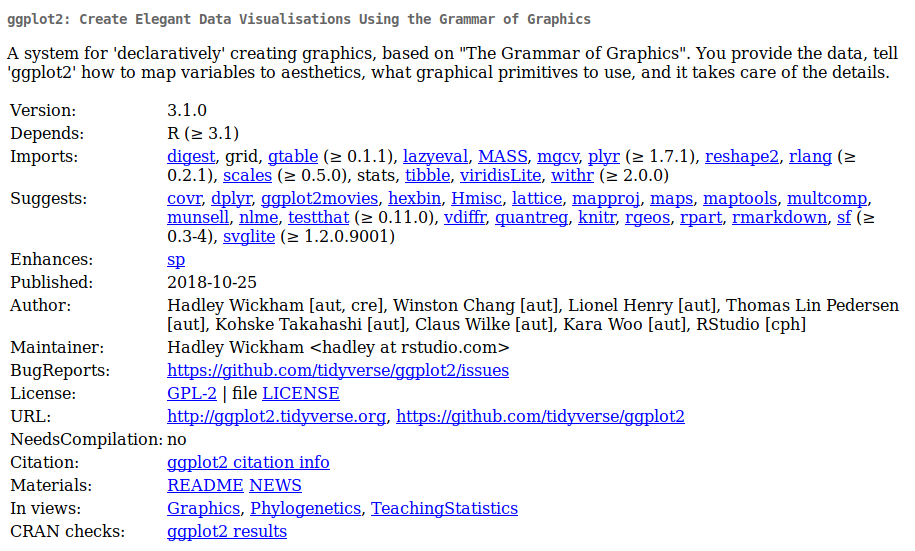
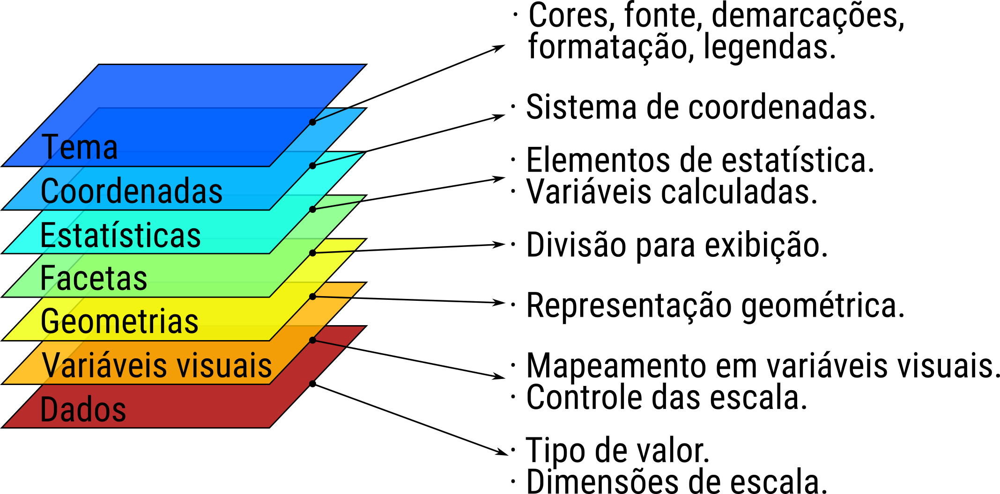
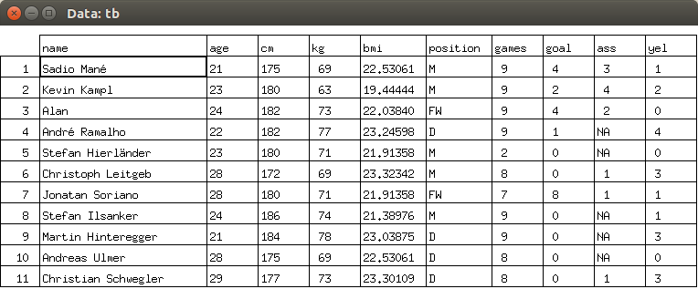
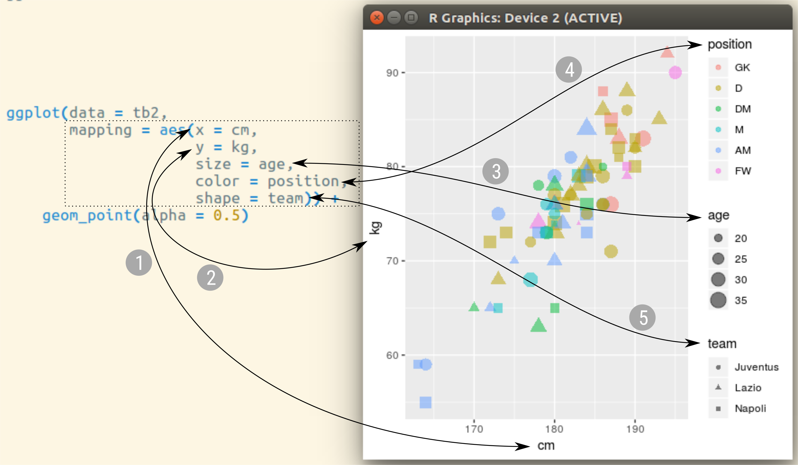
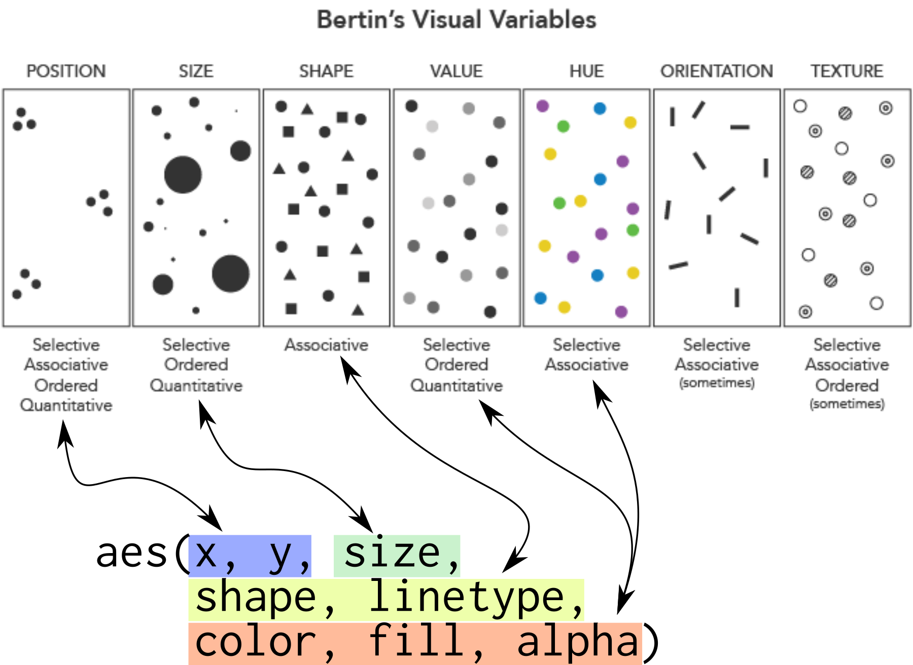
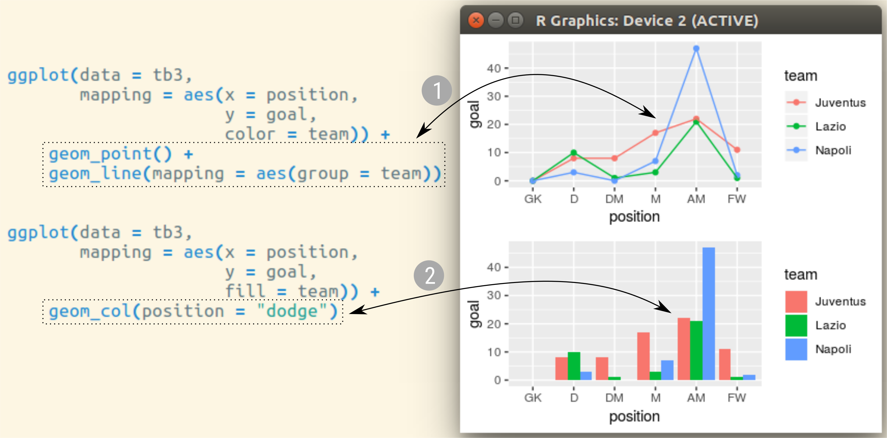
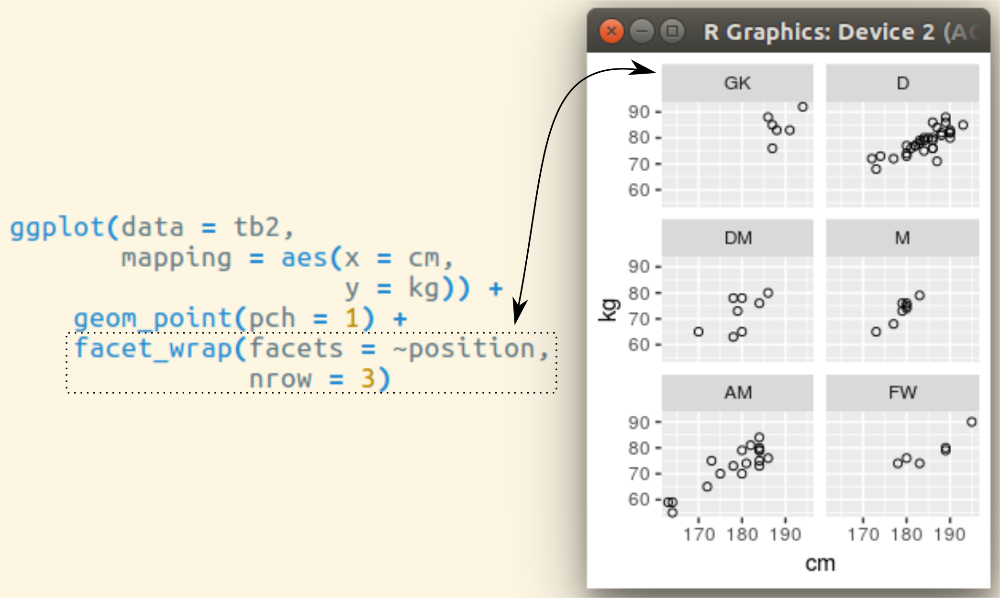
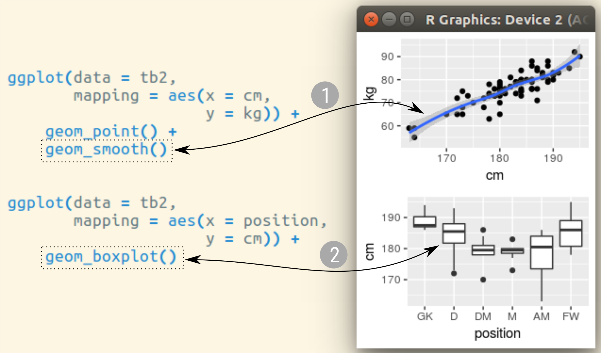
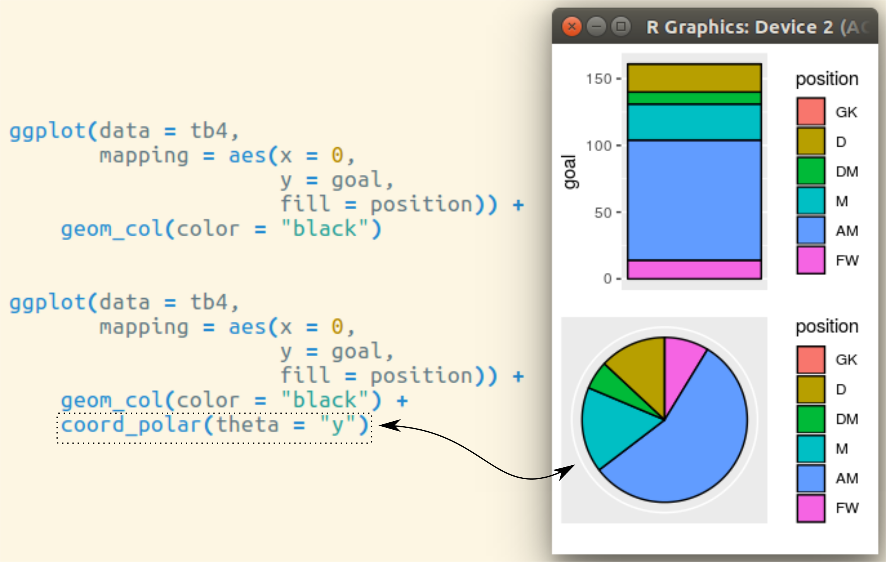
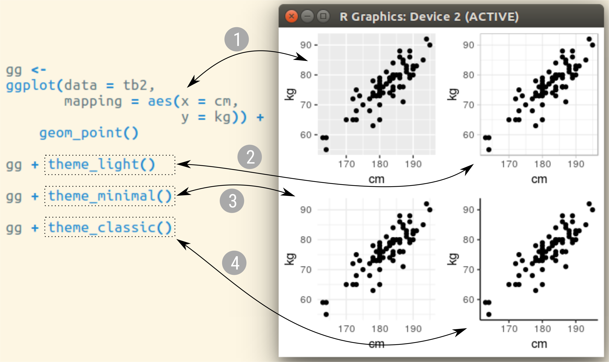

# Recursos gráficos do R

## Visão geral

<!-- IMPORTANT: Compilar com Xelatex. -->

```{r, include = FALSE}
source("config/setup.R")
library(tidyverse)
```

O [landscape de recursos para visualização] de dados no R pode ser
representado por uma divisão em 4 territórios.

  1. O pacote `graphics` e derivados.
  2. O pacote [`lattice`] e derivados.
  3. O pacote [`ggplot2`] e derivados.
  4. Pacotes para gráficos interativos.

## Pacotes para recursos interativos

A visualização interativa é voltada para exibicação na WEB.  Alguns dos
pacotes para isso são estes:

  * [`plotly`](https://plot.ly/r/).
  * [`leaflet`](https://rstudio.github.io/leaflet/).
  * [`echarts4r`](https://echarts4r.john-coene.com/index.html).
  * [`highcharter`](http://jkunst.com/highcharter/).
  * [`googleVis`](https://cran.r-project.org/web/packages/googleVis/vignettes/googleVis_examples.html).
  * [`rgl`](https://cran.r-project.org/web/packages/rgl/vignettes/rgl.html).
  * [`animation`](https://yihui.name/animation/).

# Um overview do `ggplot2`

## A ficha técnica

```{r, echo = FALSE, out.width = "10.5 cm", fig.cap = cap}
cap <- "Ficha técnica do \\texttt{ggplot2}."

```

<!-- .
## Gramática dos gráficos

\begin{figure}[h]
\centering
\includegraphics[height=3.5cm]{img/wilkinson.jpg}\hspace{1px}
\includegraphics[height=3.5cm]{img/wilkinson-the-grammar-of-graphics.jpg}\hspace{1px}
\includegraphics[height=3.5cm]{img/ggplot-grammar-of-graphics.png}
\caption{Leland Wilkinson (esq.) autor de ``The grammar of       graphics'' (meio) e as camadas da gramática de gráficos que são       usadas no \texttt{ggplot2}.}
\end{figure}
-->

## Gramática dos gráficos

```{r, echo = FALSE, out.width = "10.5 cm", fig.cap = cap}
cap <- "As camadas na gramática dos gráficos."

```

## Camada 1: dados

```{r, echo = FALSE, out.width = "10.5 cm", fig.cap = cap}
cap <- "A camada dos dados."

```

## Camada 1: dados

Deve se estar atento ao tipo de valor/objeto.

  * Quantitativa: variável numérica discreta ou contínua.
  * Qualitativa: variável nominal ou ordinal.
  * Cronológica: variável de data ou data-tempo.
  * Geográfica: objeto como polígonos, por exemplo.

## Camada 2: mapeamento em variáveis visuais

```{r, echo = FALSE, out.width = "10.5 cm", fig.cap = cap}
cap <- "A camada de mapeamento dos valores em variáveis visuais."

```

## Camada 2: mapeamento em variáveis visuais

```{r, echo = FALSE, out.width = "9.5 cm", fig.cap = cap}
cap <- "Variáveis visuais disponíveis no \\texttt{ggplot2}."

```

## Camada 2: mapeamento em variáveis visuais

Funções para controle de escala:

```{r, eval = FALSE, echo = FALSE, comment = NA}
ls_ggplot <- ls("package:ggplot2")

u <- ls("package:ggplot2") %>%
    str_subset("scale_")

ls_ggplot <- setdiff(ls_ggplot, u)

u <- u %>%
    str_replace("scale_", "") %>%
    str_subset("color", negate = TRUE)

v <- u %>%
    str_split("_") %>%
    keep(function(x) length(x) == 2) %>%
    invoke(.f = rbind)
v[, 1] <- paste0("scale_", v[, 1], "_")
v <- split(v[, 2], v[, 1])

for (i in seq(v)) {
    cat(names(v)[i], ": ", sep = "")
    p <- paste(v[[i]], collapse = " ")
    cat(paste(" ", strwrap(p, width = 65)),
        sep = "\n")
}
```

```{r, echo = FALSE, comment = NA}
ls_ggplot <- ls("package:ggplot2")

k <- 3
u <- ls("package:ggplot2") %>%
    str_subset("scale_\\w+_")

u <- u |>
    gsub(pattern = "(scale_\\w+_).*", replacement = "\\1") |>
    unique() |>
    paste0("*")

a <- (k * (length(u) %/% k + 1) - length(u)) %% k
u <- append(u, rep("", a))

MASS::write.matrix(matrix(u, ncol = k))
```

## Camada 3: geometrias

```{r, echo = FALSE, out.width = "10.5 cm", fig.cap = cap}
cap <- "A camada de elementos geométricos."

```

## Camada 3: geometrias

Funções disponíveis para a camada de geometria:

```{r, echo = FALSE, comment = NA}
k <- 3
u <- ls("package:ggplot2") %>%
    str_subset("geom_")

ls_ggplot <- setdiff(ls_ggplot, u)

a <- (k * (length(u) %/% k + 1) - length(u)) %% k
u <- append(u, rep("", a))

MASS::write.matrix(matrix(u, ncol = k))
```

## Camada 4: divisão em facetas

```{r, echo = FALSE, out.width = "10.5 cm", fig.cap = cap}
cap <- "A camada da divisão em facetas."

```

## Camada 4: divisão em facetas

Funções disponíveis para divisão em facetas:

```{r, echo = FALSE, comment = NA}
k <- 1
u <- ls("package:ggplot2") %>%
    str_subset("facet_")

ls_ggplot <- setdiff(ls_ggplot, u)

a <- (k * (length(u) %/% k + 1) - length(u)) %% k
u <- append(u, rep("", a))

MASS::write.matrix(matrix(u, ncol = k))
```

## Camada 5: estatística

```{r, echo = FALSE, out.width = "10.5 cm", fig.cap = cap}
cap <- "A camada de elementos de estatística"

```

## Camada 5: estatística

Funções disponíveis para a camada estatística:

```{r, echo = FALSE, comment = NA}
k <- 3
u <- ls("package:ggplot2") %>%
    str_subset("stat_")

ls_ggplot <- setdiff(ls_ggplot, u)

a <- (k * (length(u) %/% k + 1) - length(u)) %% k
u <- append(u, rep("", a))

MASS::write.matrix(matrix(u, ncol = k))
```

## Camada 6: coordenadas

```{r, echo = FALSE, out.width = "10.5 cm", fig.cap = cap}
cap <- "A camada do sistema de coordenadas."

```

## Camada 6: coordenadas

Funções disponíveis para a camada de coordenadas:

```{r, echo = FALSE, comment = NA}
k <- 1
u <- ls("package:ggplot2") %>%
    str_subset("coord_")

ls_ggplot <- setdiff(ls_ggplot, u)

a <- (k * (length(u) %/% k + 1) - length(u)) %% k
u <- append(u, rep("", a))

MASS::write.matrix(matrix(u, ncol = k))
```

## Camada 7: tema

```{r, echo = FALSE, out.width = "10.5 cm", fig.cap = cap}
cap <- "A camada de tema."

```

## Camada 7: tema

Funções disponíveis para a camada de tema:

```{r, echo = FALSE, comment = NA}
k <- 1
u <- ls("package:ggplot2") %>%
    str_subset("theme_")

ls_ggplot <- setdiff(ls_ggplot, u)

a <- (k * (length(u) %/% k + 1) - length(u)) %% k
u <- append(u, rep("", a))

MASS::write.matrix(matrix(u, ncol = k))
```

```{r, include = FALSE, eval = FALSE}
TODO WALMES FIXME e quais as funções que sobram?
ls_ggplot %>%
    str_subset("[[:upper:]]", negate = TRUE)
```

---

\vspace{-1.5em}
\begin{figure}
\includegraphics[page=1, width=10.5cm]{img/data-visualization.pdf}
\caption{Cartão de referência dos recursos do \texttt{ggplot2}.}
\end{figure}

---

\vspace{-1.5em}
\begin{figure}
\includegraphics[page=2, width=10.5cm]{img/data-visualization.pdf}
\caption{Cartão de referência dos recursos do \texttt{ggplot2}.}
\end{figure}

<!-- .
# Exercícios para usar o `ggplot2`

## TODO

-->

<!------------------------------------------- -->
[*Grammar of Graphics*]: http://byrneslab.net/classes/biol607/readings/wickham_layered-grammar.pdf
[landscape de recursos para visualização]: https://www.stat.ubc.ca/~jenny/STAT545A/block90_baseLatticeGgplot2.html
[Hadley Wickham]: http://hadley.nz/
[Deepayan Sarkar]: https://www.isid.ac.in/~deepayan/
[`gplots`]: https://cran.r-project.org/package=gplots
[`plotrix`]: https://cran.r-project.org/package=plotrix
[R Graph Gallery]: https://www.r-graph-gallery.com/
[`lattice`]: http://lattice.r-forge.r-project.org/
[`latticeExtra`]: http://latticeextra.r-forge.r-project.org/
[`ggplot2`]: http://ggplot2.org/
[`plotly`]: https://plot.ly/
[`plotly-R`]: https://plot.ly/r/
