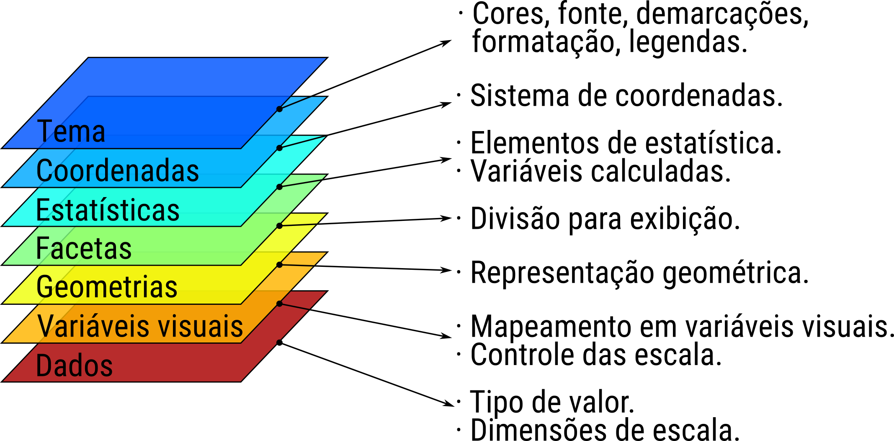
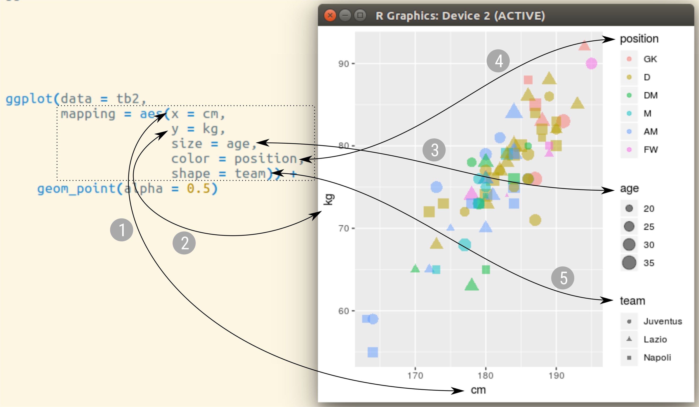
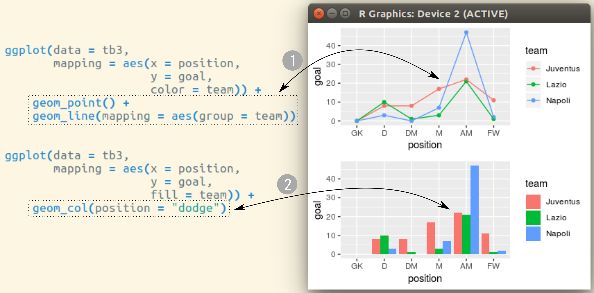
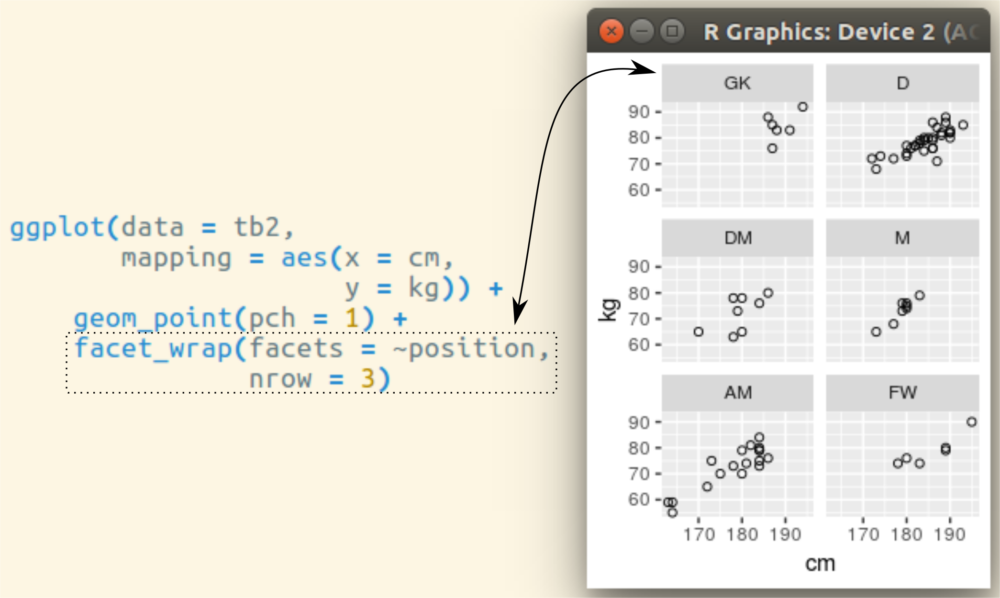
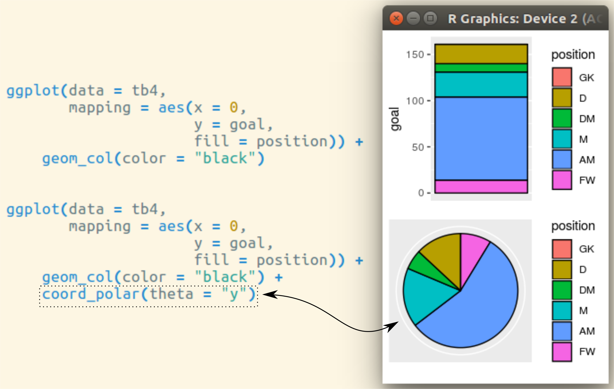
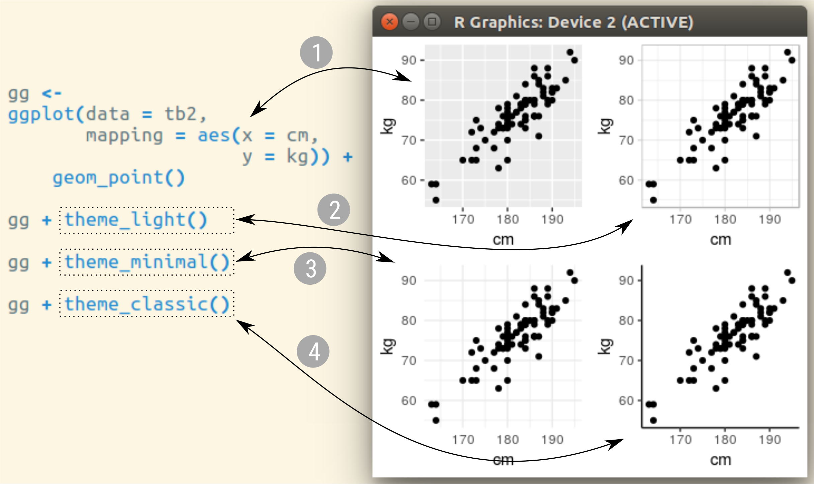

```{r, include = FALSE}
source("config/setup.R")
library(tidyverse)
```

# Um overview do `ggplot2`

## Motivação

TODO

<!-- .
## Galerias

  * <https://www.r-graph-gallery.com/portfolio/ggplot2-package/>.
  * <http://r-statistics.co/Top50-Ggplot2-Visualizations-MasterList-R-Code.html>.
  * <https://r4stats.com/examples/graphics-ggplot2/>.
  * <http://girke.bioinformatics.ucr.edu/GEN242/pages/mydoc/Rgraphics.html>.

### Extensões do `ggplot2`

  * <http://www.ggplot2-exts.org/gallery/>.
  * <https://mode.com/blog/r-ggplot-extension-packages>.

### Mapas

  * <https://rstudio-pubs-static.s3.amazonaws.com/176768_ec7fb4801e3a4772886d61e65885fbdd.html>.
  * <https://www.curso-r.com/blog/2017-05-04-mapas-tematicos-3-minutos/>.
  * <http://girke.bioinformatics.ucr.edu/GEN242/pages/mydoc/Rgraphics.html>.

### Tutoriais em português

  * <https://rpubs.com/mnunes/ggplot2>.
  * <https://analisereal.com/2015/09/19/introducao-ao-ggplot2/>.
  * <https://timogrossenbacher.ch/2016/12/beautiful-thematic-maps-with-ggplot2-only/>.
  * <http://recologia.com.br/tag/graficos/>.
  * <http://rstudio-pubs-static.s3.amazonaws.com/24563_3b7b0a6414824e3b91769a95309380f1.html>.
  * <http://eduardogutierres.com/inteligencia-geografica-gerando-mapas-em-r/>.
  * <https://pt.stackoverflow.com/questions/332053/r-mapa-de-cidades-brasileiras>.

-->

## A ficha técnica

```{r, echo = FALSE, out.width = "10.5 cm", fig.cap = cap}
cap <- "Ficha técnica do \\texttt{ggplot2}."
knitr::include_graphics("img/cran-ggplot2.png")
```

## Gramática dos gráficos

  \begin{figure}[h]
    \centering
    \includegraphics[height=3.5cm]{img/wilkinson.jpg}\hspace{1px}
    \includegraphics[height=3.5cm]{img/wilkinson-the-grammar-of-graphics.jpg}\hspace{1px}
    \includegraphics[height=3.5cm]{img/ggplot-grammar-of-graphics.png}

    \caption{Leland Wilkinson (esq.) autor de ``The grammar of
      graphics'' (meio) e as camadas da gramática de gráficos que são
      usadas no \texttt{ggplot2}.}
  \end{figure}

## Gramática dos gráficos

```{r, echo = FALSE, out.width = "10.5 cm", fig.cap = cap}
cap <- "As camadas na gramática dos gráficos."

```

## Camada 1: dados

```{r, echo = FALSE, out.width = "10.5 cm", fig.cap = cap}
cap <- "A camada dos dados."
knitr::include_graphics("img/gg-layer-data.png")
```

## Camada 1: dados

Deve se estar atento ao tipo de valor/objeto.

  * Quantitativa: variável numérica discreta ou contínua.
  * Qualitativa: variável nominal ou ordinal.
  * Cronológica: variável de data ou data-tempo.
  * Geográfica: objeto como polígonos, por exemplo.

## Camada 2: mapeamento em variáveis visuais

```{r, echo = FALSE, out.width = "10.5 cm", fig.cap = cap}
cap <- "A camada de mapeamento dos valores em variáveis visuais."

```

## Camada 2: mapeamento em variáveis visuais

```{r, echo = FALSE, out.width = "9.5 cm", fig.cap = cap}
cap <- "Variáveis visuais disponíveis no \\texttt{ggplot2}."
knitr::include_graphics("img/visual_variables-in-ggplot2.png")
```

## Camada 2: mapeamento em variáveis visuais

```{r, echo = FALSE, comment = NA}
u <- ls("package:ggplot2") %>%
    str_subset("scale_") %>%
    str_replace("scale_", "") %>%
    str_subset("color", negate = TRUE)

v <- u %>%
    str_split("_") %>%
    keep(function(x) length(x) == 2) %>%
    invoke(.f = rbind)
v[, 1] <- paste0("scale_", v[, 1], "_")
v <- split(v[, 2], v[, 1])

for (i in seq(v)) {
    cat(names(v)[i], ":\n", sep = "")
    p <- paste(v[[i]], collapse = " ")
    cat(paste(" ", strwrap(p, width = 65)),
        sep = "\n")
}
```

## Camada 3: geometrias

```{r, echo = FALSE, out.width = "10.5 cm", fig.cap = cap}
cap <- "A camada de elementos geométricos."

```

## Camada 3: geometrias

```{r, echo = FALSE, comment = NA}
library(ggplot2)

k <- 3
u <- ls("package:ggplot2") %>%
    str_subset("geom_")
a <- (k * (length(u) %/% k + 1) - length(u)) %% k
u <- append(u, rep("", a))

MASS::write.matrix(matrix(u, ncol = k))
```

## Camada 4: divisão em facetas

```{r, echo = FALSE, out.width = "10.5 cm", fig.cap = cap}
cap <- "A camada da divisão em facetas."

```

## Camada 4: divisão em facetas

```{r, echo = FALSE, comment = NA}
k <- 1
u <- ls("package:ggplot2") %>%
    str_subset("facet_")
a <- (k * (length(u) %/% k + 1) - length(u)) %% k
u <- append(u, rep("", a))

MASS::write.matrix(matrix(u, ncol = k))
```

## Camada 5: estatística

```{r, echo = FALSE, out.width = "10.5 cm", fig.cap = cap}
cap <- "A camada de elementos de estatística"
knitr::include_graphics("img/gg-layer-stat-2.png")
```

## Camada 5: estatística

```{r, echo = FALSE, comment = NA}
k <- 3
u <- ls("package:ggplot2") %>%
    str_subset("stat_")
a <- (k * (length(u) %/% k + 1) - length(u)) %% k
u <- append(u, rep("", a))

MASS::write.matrix(matrix(u, ncol = k))
```

## Camada 6: coordenadas

```{r, echo = FALSE, out.width = "10.5 cm", fig.cap = cap}
cap <- "A camada do sistema de coordenadas."

```

## Camada 6: coordenadas

```{r, echo = FALSE, comment = NA}
k <- 1
u <- ls("package:ggplot2") %>%
    str_subset("coord_")
a <- (k * (length(u) %/% k + 1) - length(u)) %% k
u <- append(u, rep("", a))

MASS::write.matrix(matrix(u, ncol = k))
```

## Camada 7: tema

```{r, echo = FALSE, out.width = "10.5 cm", fig.cap = cap}
cap <- "A camada de tema."

```

## Camada 7: tema

```{r, echo = FALSE, comment = NA}
k <- 1
u <- ls("package:ggplot2") %>%
    str_subset("theme_")
a <- (k * (length(u) %/% k + 1) - length(u)) %% k
u <- append(u, rep("", a))

MASS::write.matrix(matrix(u, ncol = k))
```


---

\vspace{-1.5em}
\begin{figure}
\includegraphics[page=1, width=10.5cm]{img/data-visualization.pdf}
\caption{Cartão de referência dos recursos do \texttt{ggplot2}.}
\end{figure}

---

\vspace{-1.5em}
\begin{figure}
\includegraphics[page=2, width=10.5cm]{img/data-visualization.pdf}
\caption{Cartão de referência dos recursos do \texttt{ggplot2}.}
\end{figure}


# Exercícios para usar o `ggplot2`

## TODO

<!-- ## Referências -->
